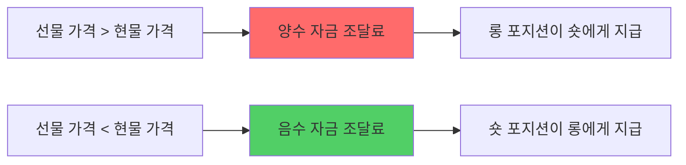

# 08_FUNDING_RATE_STRATEGY.md

<div align="center">

# 💰 **Binance USDT Perpetual Futures 자금 조달료 수익 전략 완전 가이드**

**🚀 연간 15-50% 안정 수익을 위한 델타 중립 자금 조달료 수익 극대화 시스템 🚀**

[](https://binance-docs.github.io/apidocs/futures/en/)
[](https://www.freqtrade.io/en/stable/)
[](https://github.com/freqtrade/freqtrade)

</div>

---

## 📋 목차

1. [🎯 전략 개요](#-전략-개요)
2. [💡 자금 조달료 메커니즘](#-자금-조달료-메커니즘)
3. [💎 기본 수익 전략](#-기본-수익-전략)
4. [🚀 고급 차익거래 전략](#-고급-차익거래-전략)
5. [🤖 자동화 시스템 구현](#-자동화-시스템-구현)
6. [🛡️ 리스크 관리 및 헷징](#-리스크-관리-및-헷징)
7. [🧠 AI 기반 예측 모델](#-ai-기반-예측-모델)
8. [📊 실전 포트폴리오 구성](#-실전-포트폴리오-구성)
9. [📈 성과 분석 및 최적화](#-성과-분석-및-최적화)
10. [💼 세금 및 회계 처리](#-세금-및-회계-처리)

---

## 🎯 전략 개요

### 💰 **자금 조달료란?**

자금 조달료(Funding Rate)는 **USDT Perpetual Futures**에서 현물 가격과 선물 가격의 차이를 줄이기 위한 메커니즘입니다.



### 🎯 **핵심 수익 원리**

1. **8시간마다 정산**: 매일 00:00, 08:00, 16:00 UTC
2. **양방향 포지션**: 롱/숏 동시 보유로 시장 위험 제거
3. **안정적 수익**: 시장 방향 무관한 지속적 현금 흐름
4. **레버리지 활용**: 적정 레버리지로 수익률 증대

### 📊 **역사적 수익률 분석**

| 코인 | 2023년 평균 | 2024년 평균 | 최고 연수익률 | 위험도 |
|------|------------|------------|-------------|--------|
| **BTC/USDT** | 0.0087% | 0.0124% | 18.2% | ⭐⭐ |
| **ETH/USDT** | 0.0156% | 0.0198% | 28.7% | ⭐⭐⭐ |
| **BNB/USDT** | 0.0203% | 0.0267% | 35.6% | ⭐⭐⭐ |
| **SOL/USDT** | 0.0445% | 0.0623% | 67.8% | ⭐⭐⭐⭐⭐ |

> 💡 **주의**: 과거 성과가 미래 수익을 보장하지 않습니다.

---

## 💡 자금 조달료 메커니즘

### 📐 **계산 공식**

```python
# 자금 조달료 계산
def calculate_funding_rate(premium_index: float, interest_rate: float = 0.0001) -> float:
    """
    자금 조달료 = max(0.05%, Premium Index) + Interest Rate
    """
    funding_rate = max(0.0005, premium_index) + interest_rate
    
    # Binance 제한: -0.75% ~ +0.75%
    return max(-0.0075, min(0.0075, funding_rate))

def calculate_premium_index(mark_price: float, spot_price: float) -> float:
    """
    Premium Index = (Mark Price - Spot Price) / Spot Price
    """
    return (mark_price - spot_price) / spot_price

# 실제 수익 계산
def calculate_funding_income(position_size: float, funding_rate: float, 
                           side: str, leverage: int = 1) -> float:
    """
    자금 조달료 수익 = Position Size × Funding Rate × Side Factor
    """
    side_factor = 1 if (funding_rate > 0 and side == 'short') or \
                      (funding_rate < 0 and side == 'long') else -1
    
    return position_size * abs(funding_rate) * side_factor * leverage
```

### ⏰ **정산 시간 최적화**

```python
import datetime as dt
from zoneinfo import ZoneInfo

class FundingTimeManager:
    """자금 조달료 정산 시간 관리"""
    
    @staticmethod
    def get_next_funding_time() -> dt.datetime:
        """다음 정산 시간 계산"""
        utc_now = dt.datetime.now(ZoneInfo('UTC'))
        
        # Binance 정산 시간: 00:00, 08:00, 16:00 UTC
        funding_hours = [0, 8, 16]
        
        current_hour = utc_now.hour
        next_hour = min([h for h in funding_hours if h > current_hour], default=24)
        
        if next_hour == 24:
            next_funding = utc_now.replace(hour=0, minute=0, second=0, microsecond=0)
            next_funding += dt.timedelta(days=1)
        else:
            next_funding = utc_now.replace(hour=next_hour, minute=0, second=0, microsecond=0)
        
        return next_funding
    
    @staticmethod
    def time_to_funding() -> float:
        """정산까지 남은 시간(분)"""
        next_funding = FundingTimeManager.get_next_funding_time()
        now = dt.datetime.now(ZoneInfo('UTC'))
        return (next_funding - now).total_seconds() / 60

# 사용 예제
print(f"다음 정산 시간: {FundingTimeManager.get_next_funding_time()}")
print(f"정산까지: {FundingTimeManager.time_to_funding():.1f}분")
```

### 📊 **Binance API 활용**

```python
import ccxt
import pandas as pd
from typing import Dict, List

class BinanceFundingRateAPI:
    """Binance 자금 조달료 API 래퍼"""
    
    def __init__(self, api_key: str, secret: str, testnet: bool = True):
        self.exchange = ccxt.binance({
            'apiKey': api_key,
            'secret': secret,
            'sandbox': testnet,
            'options': {'defaultType': 'future'}
        })
    
    def get_current_funding_rate(self, symbol: str) -> Dict:
        """현재 자금 조달료 조회"""
        try:
            funding_rate = self.exchange.fetch_funding_rate(symbol)
            return {
                'symbol': symbol,
                'funding_rate': funding_rate['fundingRate'],
                'funding_time': funding_rate['fundingTimestamp'],
                'mark_price': funding_rate['markPrice'],
                'index_price': funding_rate['indexPrice']
            }
        except Exception as e:
            print(f"자금 조달료 조회 실패 {symbol}: {e}")
            return {}
    
    def get_funding_history(self, symbol: str, days: int = 30) -> pd.DataFrame:
        """자금 조달료 이력 조회"""
        try:
            since = self.exchange.milliseconds() - (days * 24 * 60 * 60 * 1000)
            funding_history = self.exchange.fetch_funding_rate_history(symbol, since=since)
            
            df = pd.DataFrame([{
                'timestamp': pd.to_datetime(item['timestamp'], unit='ms'),
                'funding_rate': item['fundingRate'],
                'symbol': symbol
            } for item in funding_history])
            
            return df.set_index('timestamp')
            
        except Exception as e:
            print(f"자금 조달료 이력 조회 실패 {symbol}: {e}")
            return pd.DataFrame()
    
    def analyze_funding_patterns(self, symbol: str, days: int = 90) -> Dict:
        """자금 조달료 패턴 분석"""
        df = self.get_funding_history(symbol, days)
        
        if df.empty:
            return {}
        
        # 통계 분석
        stats = {
            'symbol': symbol,
            'period_days': days,
            'mean_rate': df['funding_rate'].mean(),
            'std_rate': df['funding_rate'].std(),
            'positive_rate_ratio': (df['funding_rate'] > 0).mean(),
            'extreme_positive_count': (df['funding_rate'] > 0.01).sum(),
            'extreme_negative_count': (df['funding_rate'] < -0.01).sum(),
            'max_rate': df['funding_rate'].max(),
            'min_rate': df['funding_rate'].min(),
            'annual_return_estimate': df['funding_rate'].mean() * 3 * 365 * 100  # 연 수익률 추정
        }
        
        # 시간대별 패턴
        df['hour'] = df.index.hour
        hourly_pattern = df.groupby('hour')['funding_rate'].agg(['mean', 'std'])
        stats['hourly_pattern'] = hourly_pattern.to_dict()
        
        return stats

# 사용 예제
api = BinanceFundingRateAPI('your_api_key', 'your_secret', testnet=True)

# 현재 자금 조달료
btc_funding = api.get_current_funding_rate('BTC/USDT')
print(f"BTC 현재 자금 조달료: {btc_funding['funding_rate']:.4%}")

# 패턴 분석
btc_analysis = api.analyze_funding_patterns('BTC/USDT', 90)
print(f"BTC 90일 평균 자금 조달료: {btc_analysis['mean_rate']:.4%}")
print(f"예상 연 수익률: {btc_analysis['annual_return_estimate']:.2f}%")
```

---

## 💎 기본 수익 전략

### 🎯 **델타 중립 포지션 구축**

델타 중립 전략은 시장 방향에 관계없이 자금 조달료만으로 수익을 창출하는 핵심 전략입니다.

```python
import numpy as np
from dataclasses import dataclass
from typing import Optional

@dataclass
class Position:
    """포지션 정보"""
    symbol: str
    side: str  # 'long' or 'short'
    size: float
    entry_price: float
    leverage: int
    margin_used: float

class DeltaNeutralStrategy:
    """델타 중립 자금 조달료 전략"""
    
    def __init__(self, total_capital: float, max_leverage: int = 3):
        self.total_capital = total_capital
        self.max_leverage = max_leverage
        self.positions = []
        self.reserved_margin_ratio = 0.2  # 20% 마진 예비
    
    def calculate_optimal_position_size(self, symbol: str, funding_rate: float, 
                                      current_price: float, volatility: float) -> Dict:
        """최적 포지션 크기 계산"""
        
        # 기본 포지션 크기 (자본의 10-30%)
        base_allocation = 0.2  # 20%
        
        # 자금 조달료 크기에 따른 조정
        funding_multiplier = min(3.0, abs(funding_rate) * 1000)  # 0.1% = 1.0x
        
        # 변동성에 따른 조정 (높은 변동성 = 낮은 할당)
        volatility_adjustment = max(0.5, 1 - (volatility - 0.02) * 10)
        
        # 최종 할당 계산
        allocation_ratio = base_allocation * funding_multiplier * volatility_adjustment
        position_value = self.total_capital * allocation_ratio
        
        # 레버리지 고려한 마진 계산
        optimal_leverage = min(self.max_leverage, max(1, int(funding_multiplier)))
        margin_required = position_value / optimal_leverage
        
        return {
            'position_value': position_value,
            'margin_required': margin_required,
            'optimal_leverage': optimal_leverage,
            'allocation_ratio': allocation_ratio,
            'expected_8h_return': position_value * abs(funding_rate)
        }
    
    def create_delta_neutral_position(self, symbol: str, funding_rate: float,
                                    current_price: float, volatility: float) -> Optional[Dict]:
        """델타 중립 포지션 생성"""
        
        # 포지션 크기 계산
        position_calc = self.calculate_optimal_position_size(
            symbol, funding_rate, current_price, volatility
        )
        
        # 사용 가능한 마진 확인
        used_margin = sum(pos.margin_used for pos in self.positions)
        available_margin = self.total_capital * (1 - self.reserved_margin_ratio) - used_margin
        
        if position_calc['margin_required'] * 2 > available_margin:  # 롱+숏 마진
            print(f"⚠️ 마진 부족: 필요 {position_calc['margin_required']*2:.2f}, 사용가능 {available_margin:.2f}")
            return None
        
        # 수익성 있는 사이드 결정
        if funding_rate > 0:
            primary_side = 'short'  # 롱이 숏에게 지급 -> 숏 포지션이 수익
            hedge_side = 'long'
        else:
            primary_side = 'long'   # 숏이 롱에게 지급 -> 롱 포지션이 수익
            hedge_side = 'short'
        
        position_size = position_calc['position_value'] / current_price
        leverage = position_calc['optimal_leverage']
        margin_per_side = position_calc['margin_required']
        
        # 포지션 생성
        primary_position = Position(
            symbol=symbol,
            side=primary_side,
            size=position_size,
            entry_price=current_price,
            leverage=leverage,
            margin_used=margin_per_side
        )
        
        hedge_position = Position(
            symbol=symbol,
            side=hedge_side,
            size=position_size,
            entry_price=current_price,
            leverage=leverage,
            margin_used=margin_per_side
        )
        
        return {
            'primary_position': primary_position,
            'hedge_position': hedge_position,
            'expected_8h_income': position_calc['expected_8h_return'],
            'total_margin_used': margin_per_side * 2,
            'roi_8h': (position_calc['expected_8h_return'] / (margin_per_side * 2)) * 100
        }
    
    def rebalance_positions(self) -> List[Dict]:
        """포지션 리밸런싱"""
        rebalance_actions = []
        
        for i in range(0, len(self.positions), 2):  # 쌍으로 처리
            if i + 1 >= len(self.positions):
                continue
                
            pos1, pos2 = self.positions[i], self.positions[i+1]
            
            # 같은 심볼의 롱/숏 쌍인지 확인
            if pos1.symbol != pos2.symbol:
                continue
            
            # 포지션 크기 불균형 확인
            size_diff = abs(pos1.size - pos2.size)
            avg_size = (pos1.size + pos2.size) / 2
            
            if size_diff / avg_size > 0.05:  # 5% 이상 차이
                target_size = avg_size
                
                rebalance_actions.append({
                    'action': 'rebalance',
                    'symbol': pos1.symbol,
                    'long_adjustment': target_size - (pos1.size if pos1.side == 'long' else pos2.size),
                    'short_adjustment': target_size - (pos1.size if pos1.side == 'short' else pos2.size)
                })
        
        return rebalance_actions

# 전략 실행 예제
strategy = DeltaNeutralStrategy(total_capital=10000, max_leverage=3)

# BTC 델타 중립 포지션 생성
btc_funding_rate = 0.0123  # 1.23% (8시간 기준)
btc_price = 45000
btc_volatility = 0.04  # 4% 일일 변동성

position_plan = strategy.create_delta_neutral_position(
    'BTC/USDT', btc_funding_rate, btc_price, btc_volatility
)

if position_plan:
    print("🚀 BTC 델타 중립 포지션 계획:")
    print(f"   Primary: {position_plan['primary_position'].side.upper()} {position_plan['primary_position'].size:.4f} BTC")
    print(f"   Hedge: {position_plan['hedge_position'].side.upper()} {position_plan['hedge_position'].size:.4f} BTC")
    print(f"   예상 8시간 수익: ${position_plan['expected_8h_income']:.2f}")
    print(f"   8시간 ROI: {position_plan['roi_8h']:.3f}%")
    print(f"   연환산 ROI: {position_plan['roi_8h'] * 3 * 365:.1f}%")
```

### 📊 **다중 코인 포트폴리오 구성**

```python
class MultipleCoinFundingStrategy:
    """다중 코인 자금 조달료 포트폴리오"""
    
    def __init__(self, total_capital: float):
        self.total_capital = total_capital
        self.positions = {}
        self.target_coins = ['BTC/USDT', 'ETH/USDT', 'BNB/USDT', 'SOL/USDT', 
                            'ADA/USDT', 'DOT/USDT', 'AVAX/USDT', 'MATIC/USDT']
        
    def analyze_all_funding_rates(self, api: BinanceFundingRateAPI) -> pd.DataFrame:
        """모든 타겟 코인의 자금 조달료 분석"""
        
        results = []
        for symbol in self.target_coins:
            try:
                current_rate = api.get_current_funding_rate(symbol)
                analysis = api.analyze_funding_patterns(symbol, 90)
                
                if current_rate and analysis:
                    results.append({
                        'symbol': symbol,
                        'current_rate': current_rate['funding_rate'],
                        'mean_90d': analysis['mean_rate'],
                        'std_90d': analysis['std_rate'],
                        'positive_ratio': analysis['positive_rate_ratio'],
                        'annual_estimate': analysis['annual_return_estimate'],
                        'sharpe_ratio': analysis['mean_rate'] / analysis['std_rate'] if analysis['std_rate'] > 0 else 0,
                        'mark_price': current_rate['mark_price']
                    })
            except Exception as e:
                print(f"분석 실패 {symbol}: {e}")
        
        df = pd.DataFrame(results)
        
        if not df.empty:
            # 점수 계산 (현재 자금 조달료 절댓값 + 샤프 비율)
            df['score'] = (df['current_rate'].abs() * 1000) + (df['sharpe_ratio'] * 100)
            df = df.sort_values('score', ascending=False)
        
        return df
    
    def create_diversified_portfolio(self, api: BinanceFundingRateAPI, 
                                   max_positions: int = 5) -> Dict:
        """분산 포트폴리오 생성"""
        
        # 모든 코인 분석
        analysis_df = self.analyze_all_funding_rates(api)
        
        if analysis_df.empty:
            return {'error': '분석 데이터 없음'}
        
        # 상위 코인 선택 (유의미한 자금 조달료만)
        significant_funding = analysis_df[analysis_df['current_rate'].abs() > 0.0005]  # 0.05% 이상
        top_coins = significant_funding.head(max_positions)
        
        portfolio = {
            'coins': [],
            'total_expected_8h_return': 0,
            'total_margin_used': 0,
            'diversification_score': len(top_coins)
        }
        
        # 각 코인별 자본 배분
        capital_per_coin = self.total_capital / len(top_coins)
        
        for _, coin_data in top_coins.iterrows():
            symbol = coin_data['symbol']
            funding_rate = coin_data['current_rate']
            price = coin_data['mark_price']
            
            # 간단한 변동성 추정 (실제로는 더 정교한 계산 필요)
            volatility = coin_data['std_90d'] * np.sqrt(365 * 3)  # 연환산
            
            # 델타 중립 전략으로 포지션 계산
            strategy = DeltaNeutralStrategy(capital_per_coin, max_leverage=3)
            position_plan = strategy.create_delta_neutral_position(
                symbol, funding_rate, price, volatility
            )
            
            if position_plan:
                coin_info = {
                    'symbol': symbol,
                    'funding_rate': funding_rate,
                    'position_plan': position_plan,
                    'allocation_ratio': capital_per_coin / self.total_capital,
                    'risk_score': abs(funding_rate) / volatility if volatility > 0 else 0
                }
                
                portfolio['coins'].append(coin_info)
                portfolio['total_expected_8h_return'] += position_plan['expected_8h_income']
                portfolio['total_margin_used'] += position_plan['total_margin_used']
        
        # 포트폴리오 메트릭스 계산
        if portfolio['total_margin_used'] > 0:
            portfolio['portfolio_8h_roi'] = (portfolio['total_expected_8h_return'] / 
                                           portfolio['total_margin_used']) * 100
            portfolio['estimated_annual_return'] = portfolio['portfolio_8h_roi'] * 3 * 365
            portfolio['capital_efficiency'] = portfolio['total_margin_used'] / self.total_capital
        
        return portfolio
    
    def print_portfolio_summary(self, portfolio: Dict):
        """포트폴리오 요약 출력"""
        
        if 'error' in portfolio:
            print(f"❌ {portfolio['error']}")
            return
        
        print("\n🏦 자금 조달료 포트폴리오 요약")
        print("=" * 60)
        
        for coin in portfolio['coins']:
            symbol = coin['symbol']
            rate = coin['funding_rate']
            allocation = coin['allocation_ratio'] * 100
            expected_return = coin['position_plan']['expected_8h_income']
            
            print(f"📊 {symbol}")
            print(f"   자금 조달료: {rate:+.4%} | 배분: {allocation:.1f}%")
            print(f"   8시간 예상 수익: ${expected_return:.2f}")
            print()
        
        print(f"💰 총 8시간 예상 수익: ${portfolio['total_expected_8h_return']:.2f}")
        print(f"📈 8시간 ROI: {portfolio.get('portfolio_8h_roi', 0):.3f}%")
        print(f"🚀 연환산 수익률: {portfolio.get('estimated_annual_return', 0):.1f}%")
        print(f"⚖️ 자본 효율성: {portfolio.get('capital_efficiency', 0):.1%}")
        print(f"🎯 분산도: {portfolio['diversification_score']}개 코인")

# 포트폴리오 실행 예제
api = BinanceFundingRateAPI('your_api_key', 'your_secret', testnet=True)
portfolio_strategy = MultipleCoinFundingStrategy(total_capital=50000)

# 분산 포트폴리오 생성
portfolio = portfolio_strategy.create_diversified_portfolio(api, max_positions=6)
portfolio_strategy.print_portfolio_summary(portfolio)
```

---

## 🚀 고급 차익거래 전략

### 💹 **크로스 거래소 자금 조달료 차익거래**

서로 다른 거래소 간의 자금 조달료 차이를 활용한 고급 전략입니다.

```python
import asyncio
import aiohttp
from typing import Dict, List
from dataclasses import dataclass

@dataclass
class ExchangeFundingRate:
    """거래소별 자금 조달료 정보"""
    exchange: str
    symbol: str
    funding_rate: float
    next_funding_time: int
    mark_price: float
    
class CrossExchangeArbitrage:
    """크로스 거래소 자금 조달료 차익거래"""
    
    def __init__(self):
        self.exchanges = {
            'binance': {
                'api_url': 'https://fapi.binance.com',
                'funding_path': '/fapi/v1/premiumIndex'
            },
            'bybit': {
                'api_url': 'https://api.bybit.com',
                'funding_path': '/v2/public/tickers'
            },
            'okx': {
                'api_url': 'https://www.okx.com',
                'funding_path': '/api/v5/public/funding-rate'
            }
        }
        
    async def fetch_funding_rates(self, session: aiohttp.ClientSession, 
                                 symbols: List[str]) -> Dict[str, List[ExchangeFundingRate]]:
        """모든 거래소의 자금 조달료 조회"""
        
        results = {}
        
        for exchange, config in self.exchanges.items():
            try:
                exchange_rates = await self._fetch_exchange_funding_rates(
                    session, exchange, config, symbols
                )
                results[exchange] = exchange_rates
            except Exception as e:
                print(f"거래소 {exchange} 조회 실패: {e}")
                results[exchange] = []
        
        return results
    
    async def _fetch_exchange_funding_rates(self, session: aiohttp.ClientSession,
                                          exchange: str, config: Dict, 
                                          symbols: List[str]) -> List[ExchangeFundingRate]:
        """특정 거래소 자금 조달료 조회"""
        
        if exchange == 'binance':
            return await self._fetch_binance_rates(session, config, symbols)
        elif exchange == 'bybit':
            return await self._fetch_bybit_rates(session, config, symbols)
        elif exchange == 'okx':
            return await self._fetch_okx_rates(session, config, symbols)
        
        return []
    
    async def _fetch_binance_rates(self, session: aiohttp.ClientSession,
                                  config: Dict, symbols: List[str]) -> List[ExchangeFundingRate]:
        """Binance 자금 조달료 조회"""
        
        url = config['api_url'] + config['funding_path']
        
        async with session.get(url) as response:
            data = await response.json()
            
            rates = []
            for item in data:
                symbol = item['symbol']
                if any(s.replace('/', '').replace('USDT', 'USDT') == symbol for s in symbols):
                    rates.append(ExchangeFundingRate(
                        exchange='binance',
                        symbol=symbol,
                        funding_rate=float(item['lastFundingRate']),
                        next_funding_time=int(item['nextFundingTime']),
                        mark_price=float(item['markPrice'])
                    ))
            
            return rates
    
    def find_arbitrage_opportunities(self, funding_data: Dict[str, List[ExchangeFundingRate]], 
                                   min_spread: float = 0.005) -> List[Dict]:
        """차익거래 기회 탐지"""
        
        opportunities = []
        
        # 심볼별로 그룹화
        symbol_groups = {}
        for exchange, rates in funding_data.items():
            for rate in rates:
                symbol_normalized = self._normalize_symbol(rate.symbol)
                if symbol_normalized not in symbol_groups:
                    symbol_groups[symbol_normalized] = {}
                symbol_groups[symbol_normalized][exchange] = rate
        
        # 차익거래 기회 검색
        for symbol, exchange_rates in symbol_groups.items():
            if len(exchange_rates) < 2:  # 최소 2개 거래소 필요
                continue
            
            # 자금 조달료 정렬
            sorted_rates = sorted(exchange_rates.items(), 
                                key=lambda x: x[1].funding_rate)
            
            lowest_exchange, lowest_rate = sorted_rates[0]
            highest_exchange, highest_rate = sorted_rates[-1]
            
            spread = highest_rate.funding_rate - lowest_rate.funding_rate
            
            if spread > min_spread:  # 의미있는 스프레드
                opportunities.append({
                    'symbol': symbol,
                    'spread': spread,
                    'spread_bps': spread * 10000,  # basis points
                    'long_exchange': lowest_exchange,
                    'long_rate': lowest_rate.funding_rate,
                    'long_price': lowest_rate.mark_price,
                    'short_exchange': highest_exchange,
                    'short_rate': highest_rate.funding_rate,
                    'short_price': highest_rate.mark_price,
                    'price_diff': (highest_rate.mark_price - lowest_rate.mark_price) / lowest_rate.mark_price,
                    'estimated_8h_profit_rate': spread,
                    'next_funding_time': min(lowest_rate.next_funding_time, highest_rate.next_funding_time)
                })
        
        # 수익성 순으로 정렬
        opportunities.sort(key=lambda x: x['spread'], reverse=True)
        return opportunities
    
    def _normalize_symbol(self, symbol: str) -> str:
        """심볼명 정규화"""
        # 거래소별 심볼 형식 통일
        symbol = symbol.upper()
        symbol = symbol.replace('USDT', '/USDT')
        symbol = symbol.replace('USD', '/USD')
        return symbol
    
    def calculate_arbitrage_profit(self, opportunity: Dict, position_size: float,
                                 leverage_long: int = 1, leverage_short: int = 1) -> Dict:
        """차익거래 수익 계산"""
        
        # 기본 수익 (자금 조달료 차이)
        funding_profit = position_size * opportunity['spread']
        
        # 가격 차이로 인한 손익 (마이너스 요소)
        price_diff_cost = position_size * abs(opportunity['price_diff'])
        
        # 거래 수수료 추정 (각 거래소 0.04% 가정)
        trading_fees = position_size * 0.0004 * 4  # 진입/청산 각 2회
        
        # 순수익 계산
        net_profit = funding_profit - price_diff_cost - trading_fees
        
        # 필요 마진
        required_margin_long = position_size / leverage_long
        required_margin_short = position_size / leverage_short
        total_margin = required_margin_long + required_margin_short
        
        return {
            'funding_profit': funding_profit,
            'price_diff_cost': price_diff_cost,
            'trading_fees': trading_fees,
            'net_profit': net_profit,
            'total_margin_required': total_margin,
            'roi_8h': (net_profit / total_margin) * 100 if total_margin > 0 else 0,
            'annual_roi': (net_profit / total_margin) * 3 * 365 * 100 if total_margin > 0 else 0
        }

# 사용 예제
async def run_cross_exchange_analysis():
    arbitrage = CrossExchangeArbitrage()
    
    symbols = ['BTC/USDT', 'ETH/USDT', 'BNB/USDT', 'SOL/USDT']
    
    async with aiohttp.ClientSession() as session:
        # 모든 거래소 자금 조달료 조회
        funding_data = await arbitrage.fetch_funding_rates(session, symbols)
        
        # 차익거래 기회 탐지
        opportunities = arbitrage.find_arbitrage_opportunities(funding_data, min_spread=0.002)
        
        print("🔍 크로스 거래소 차익거래 기회 분석")
        print("=" * 80)
        
        for i, opp in enumerate(opportunities[:5], 1):  # 상위 5개
            print(f"\n🎯 기회 #{i}: {opp['symbol']}")
            print(f"   스프레드: {opp['spread']:+.4%} ({opp['spread_bps']:+.1f} bps)")
            print(f"   롱 포지션: {opp['long_exchange']} ({opp['long_rate']:+.4%})")
            print(f"   숏 포지션: {opp['short_exchange']} ({opp['short_rate']:+.4%})")
            print(f"   가격 차이: {opp['price_diff']:+.4%}")
            
            # 10,000 USDT 포지션으로 수익 계산
            profit_calc = arbitrage.calculate_arbitrage_profit(opp, 10000)
            print(f"   예상 8시간 순수익: ${profit_calc['net_profit']:.2f}")
            print(f"   ROI: {profit_calc['roi_8h']:.3f}% (8시간) / {profit_calc['annual_roi']:.1f}% (연간)")

# 실행
# asyncio.run(run_cross_exchange_analysis())
```

### 📊 **현물-선물 베이시스 거래**

```python
class SpotFutureBasisTrading:
    """현물-선물 베이시스 거래 전략"""
    
    def __init__(self, spot_exchange, futures_exchange):
        self.spot_exchange = spot_exchange
        self.futures_exchange = futures_exchange
        
    def calculate_basis(self, symbol: str) -> Dict:
        """베이시스 계산"""
        
        # 현물 가격
        spot_ticker = self.spot_exchange.fetch_ticker(symbol)
        spot_price = spot_ticker['last']
        
        # 선물 가격
        futures_ticker = self.futures_exchange.fetch_ticker(symbol)
        futures_price = futures_ticker['last']
        
        # 베이시스 계산
        basis_absolute = futures_price - spot_price
        basis_percentage = (basis_absolute / spot_price) * 100
        
        # 자금 조달료 정보
        funding_rate = self.futures_exchange.fetch_funding_rate(symbol)
        
        return {
            'symbol': symbol,
            'spot_price': spot_price,
            'futures_price': futures_price,
            'basis_absolute': basis_absolute,
            'basis_percentage': basis_percentage,
            'funding_rate': funding_rate['fundingRate'],
            'implied_annual_rate': funding_rate['fundingRate'] * 3 * 365 * 100,
            'basis_trade_opportunity': abs(basis_percentage) > 0.1  # 0.1% 이상
        }
    
    def execute_basis_trade(self, symbol: str, amount: float, 
                           trade_type: str = 'convergence') -> Dict:
        """베이시스 거래 실행"""
        
        basis_info = self.calculate_basis(symbol)
        
        if trade_type == 'convergence':
            # 베이시스 수렴 거래: 베이시스가 클 때 수렴 bet
            if basis_info['basis_percentage'] > 0.1:  # 프리미엄
                # 현물 매수 + 선물 매도
                spot_order = {
                    'exchange': 'spot',
                    'action': 'buy',
                    'symbol': symbol,
                    'amount': amount,
                    'expected_profit_source': 'basis_convergence'
                }
                
                futures_order = {
                    'exchange': 'futures',
                    'action': 'sell',
                    'symbol': symbol,
                    'amount': amount,
                    'expected_profit_source': 'basis_convergence'
                }
                
                return {
                    'strategy': 'convergence_premium',
                    'spot_order': spot_order,
                    'futures_order': futures_order,
                    'expected_profit': amount * (basis_info['basis_percentage'] / 100),
                    'funding_bonus': amount * basis_info['funding_rate']  # 추가 자금조달료 수익
                }
            
            elif basis_info['basis_percentage'] < -0.1:  # 디스카운트
                # 현물 매도 + 선물 매수
                return {
                    'strategy': 'convergence_discount',
                    'expected_profit': amount * abs(basis_info['basis_percentage'] / 100)
                }
        
        return {'message': 'No profitable opportunity'}

# 사용 예제
basis_trader = SpotFutureBasisTrading(
    spot_exchange=ccxt.binance({'defaultType': 'spot'}),
    futures_exchange=ccxt.binance({'defaultType': 'future'})
)

btc_basis = basis_trader.calculate_basis('BTC/USDT')
print(f"BTC 베이시스: {btc_basis['basis_percentage']:+.3f}%")
print(f"자금 조달료: {btc_basis['funding_rate']:+.4%}")
print(f"연환산 내재 금리: {btc_basis['implied_annual_rate']:+.2f}%")
```

---

## 🤖 자동화 시스템 구현

### 🔧 **Freqtrade 자금 조달료 전략 구현**

```python
# user_data/strategies/FundingRateStrategy.py

import pandas as pd
import numpy as np
from freqtrade.strategy import IStrategy, informative
from freqtrade.persistence import Trade
from typing import Dict, List, Optional, Tuple
import ccxt
from datetime import datetime, timedelta
import logging

logger = logging.getLogger(__name__)

class FundingRateStrategy(IStrategy):
    """
    자금 조달료 수익 전략
    - 델타 중립 포지션으로 시장 위험 제거
    - 자금 조달료 패턴 분석 기반 진입/청산
    - 다중 코인 포트폴리오 자동 관리
    """
    
    INTERFACE_VERSION = 3
    
    # 전략 설정
    timeframe = '15m'
    can_short = True
    
    # ROI 및 스탑로스 (자금조달료 전략은 장기 보유)
    minimal_roi = {
        "0": 0.01,      # 1% 수익시 청산 고려
        "480": 0.005,   # 8시간 후 0.5%
        "1440": 0.002   # 24시간 후 0.2%
    }
    
    stoploss = -0.05  # 5% 스탑로스 (비상시)
    
    # 매개변수
    funding_threshold = 0.0025  # 최소 자금조달료 (0.25%)
    max_positions_per_pair = 2  # 롱+숏 포지션
    capital_allocation_per_pair = 0.15  # 코인당 자본 15%
    
    # 전략 변수
    last_funding_check = {}
    funding_rates_cache = {}
    
    def informative_pairs(self):
        """정보 수집용 페어"""
        pairs = self.dp.current_whitelist()
        informative_pairs = []
        
        for pair in pairs:
            informative_pairs.append((pair, '1h'))  # 자금조달료 패턴용
            
        return informative_pairs
    
    def populate_indicators(self, dataframe: pd.DataFrame, metadata: Dict) -> pd.DataFrame:
        """기술 지표 추가"""
        
        # 변동성 지표
        dataframe['volatility'] = dataframe['close'].rolling(24).std()
        dataframe['volatility_percentile'] = dataframe['volatility'].rolling(168).rank(pct=True)
        
        # 자금조달료 관련 지표
        funding_rate = self.get_current_funding_rate(metadata['pair'])
        dataframe['funding_rate'] = funding_rate
        dataframe['funding_rate_ma'] = dataframe['funding_rate'].rolling(8).mean()
        
        # 시장 강도 지표 (자금조달료 예측용)
        dataframe['rsi'] = ta.RSI(dataframe)
        dataframe['bb_upper'], dataframe['bb_middle'], dataframe['bb_lower'] = ta.BBANDS(dataframe['close'])
        
        # 자금조달료 시간 근접도
        dataframe['hours_to_funding'] = self.get_hours_to_funding()
        
        return dataframe
    
    def get_current_funding_rate(self, pair: str) -> float:
        """현재 자금조달료 조회"""
        try:
            if pair in self.funding_rates_cache:
                cache_time, rate = self.funding_rates_cache[pair]
                if datetime.now() - cache_time < timedelta(minutes=30):  # 30분 캐시
                    return rate
            
            # Binance API 호출
            exchange = self.dp._exchange
            funding_info = exchange.fetch_funding_rate(pair)
            rate = funding_info['fundingRate']
            
            self.funding_rates_cache[pair] = (datetime.now(), rate)
            return rate
            
        except Exception as e:
            logger.warning(f"자금조달료 조회 실패 {pair}: {e}")
            return 0.0
    
    def get_hours_to_funding(self) -> float:
        """다음 자금조달료 정산까지 시간"""
        now = datetime.utcnow()
        funding_hours = [0, 8, 16]
        
        current_hour = now.hour
        next_funding_hour = min([h for h in funding_hours if h > current_hour], default=24)
        
        if next_funding_hour == 24:
            next_funding = now.replace(hour=0, minute=0, second=0, microsecond=0)
            next_funding += timedelta(days=1)
        else:
            next_funding = now.replace(hour=next_funding_hour, minute=0, second=0, microsecond=0)
        
        return (next_funding - now).total_seconds() / 3600
    
    def populate_entry_trend(self, dataframe: pd.DataFrame, metadata: Dict) -> pd.DataFrame:
        """진입 조건"""
        
        pair = metadata['pair']
        
        conditions_long = [
            # 기본 조건: 유의미한 자금조달료
            dataframe['funding_rate'].abs() > self.funding_threshold,
            
            # 음수 자금조달료 (롱이 수익)
            dataframe['funding_rate'] < 0,
            
            # 자금조달료 시간 근접 (6시간 이내)
            dataframe['hours_to_funding'] < 6.0,
            
            # 변동성이 너무 높지 않음
            dataframe['volatility_percentile'] < 0.8,
            
            # RSI 중립 구간 (극단적 상황 회피)
            (dataframe['rsi'] > 25) & (dataframe['rsi'] < 75)
        ]
        
        conditions_short = [
            # 기본 조건: 유의미한 자금조달료
            dataframe['funding_rate'].abs() > self.funding_threshold,
            
            # 양수 자금조달료 (숏이 수익)
            dataframe['funding_rate'] > 0,
            
            # 자금조달료 시간 근접 (6시간 이내)
            dataframe['hours_to_funding'] < 6.0,
            
            # 변동성이 너무 높지 않음
            dataframe['volatility_percentile'] < 0.8,
            
            # RSI 중립 구간
            (dataframe['rsi'] > 25) & (dataframe['rsi'] < 75)
        ]
        
        # 진입 신호
        dataframe.loc[
            reduce(lambda x, y: x & y, conditions_long),
            'enter_long'
        ] = 1
        
        dataframe.loc[
            reduce(lambda x, y: x & y, conditions_short),
            'enter_short'
        ] = 1
        
        # 태그 설정
        dataframe.loc[dataframe['enter_long'] == 1, 'enter_tag'] = 'funding_long'
        dataframe.loc[dataframe['enter_short'] == 1, 'enter_tag'] = 'funding_short'
        
        return dataframe
    
    def populate_exit_trend(self, dataframe: pd.DataFrame, metadata: Dict) -> pd.DataFrame:
        """청산 조건"""
        
        conditions_exit_long = [
            # 자금조달료가 양수로 전환 (더 이상 수익 없음)
            dataframe['funding_rate'] > 0.001,
            
            # 또는 자금조달료 크기가 임계값 이하로 감소
            dataframe['funding_rate'].abs() < (self.funding_threshold * 0.3)
        ]
        
        conditions_exit_short = [
            # 자금조달료가 음수로 전환 (더 이상 수익 없음)
            dataframe['funding_rate'] < -0.001,
            
            # 또는 자금조달료 크기가 임계값 이하로 감소
            dataframe['funding_rate'].abs() < (self.funding_threshold * 0.3)
        ]
        
        # 청산 신호
        dataframe.loc[
            reduce(lambda x, y: x | y, conditions_exit_long),
            'exit_long'
        ] = 1
        
        dataframe.loc[
            reduce(lambda x, y: x | y, conditions_exit_short),
            'exit_short'
        ] = 1
        
        # 태그 설정
        dataframe.loc[dataframe['exit_long'] == 1, 'exit_tag'] = 'funding_change'
        dataframe.loc[dataframe['exit_short'] == 1, 'exit_tag'] = 'funding_change'
        
        return dataframe
    
    def custom_stake_amount(self, pair: str, current_time, current_rate: float, 
                          proposed_stake: float, min_stake: Optional[float], 
                          max_stake: float, leverage: float, entry_tag: Optional[str],
                          side: str, **kwargs) -> float:
        """포지션 크기 계산"""
        
        # 기본 배분
        base_stake = self.wallets.get_total_stake_amount() * self.capital_allocation_per_pair
        
        # 자금조달료 크기에 따른 조정
        funding_rate = self.get_current_funding_rate(pair)
        funding_multiplier = min(2.0, abs(funding_rate) * 200)  # 최대 2배
        
        adjusted_stake = base_stake * funding_multiplier
        
        # 제한값 적용
        final_stake = max(min_stake or 0, min(adjusted_stake, max_stake))
        
        logger.info(f"포지션 크기 계산 {pair}: ${final_stake:.2f} (자금조달료: {funding_rate:.4%})")
        
        return final_stake
    
    def custom_exit(self, pair: str, trade: Trade, current_time, current_rate: float,
                   current_profit: float, **kwargs) -> Optional[Union[str, bool]]:
        """커스텀 청산 로직"""
        
        # 자금조달료 정산 후 수익 실현
        hours_to_funding = self.get_hours_to_funding()
        
        if hours_to_funding > 7.5:  # 방금 정산됨
            if current_profit > 0.002:  # 0.2% 이상 수익
                return "funding_realized"
        
        # 포지션이 너무 오래됨 (72시간 = 9번 정산)
        if (current_time - trade.open_date_utc).total_seconds() > 72 * 3600:
            return "max_holding_time"
        
        return None
    
    def confirm_trade_entry(self, pair: str, order_type: str, amount: float,
                          rate: float, time_in_force: str, current_time,
                          entry_tag: Optional[str], side: str, **kwargs) -> bool:
        """거래 진입 확인"""
        
        # 델타 중립 포지션 확인
        open_trades = Trade.get_trades_proxy(is_open=True)
        pair_trades = [t for t in open_trades if t.pair == pair]
        
        # 이미 양방향 포지션이 있다면 추가 진입 금지
        has_long = any(t.is_short is False for t in pair_trades)
        has_short = any(t.is_short is True for t in pair_trades)
        
        if side == 'long' and has_long:
            logger.info(f"롱 포지션 이미 존재 {pair}")
            return False
        elif side == 'short' and has_short:
            logger.info(f"숏 포지션 이미 존재 {pair}")
            return False
        
        # 자금조달료 재확인
        current_funding = self.get_current_funding_rate(pair)
        if abs(current_funding) < self.funding_threshold:
            logger.info(f"자금조달료 부족 {pair}: {current_funding:.4%}")
            return False
        
        return True
    
    def leverage(self, pair: str, current_time, current_rate: float,
                proposed_leverage: float, max_leverage: float, entry_tag: Optional[str],
                side: str, **kwargs) -> float:
        """레버리지 설정"""
        
        # 자금조달료 전략은 낮은 레버리지 사용
        funding_rate = self.get_current_funding_rate(pair)
        
        if abs(funding_rate) > 0.005:  # 0.5% 이상
            return min(3.0, max_leverage)
        elif abs(funding_rate) > 0.0025:  # 0.25% 이상
            return min(2.0, max_leverage)
        else:
            return 1.0  # 레버리지 없음

# 전략 사용을 위한 설정
# user_data/config_funding.json
funding_config = {
    "trading_mode": "futures",
    "margin_mode": "isolated",
    
    "strategy": "FundingRateStrategy",
    "strategy_path": "user_data/strategies/",
    
    "exchange": {
        "name": "binance",
        "pair_whitelist": [
            "BTC/USDT", "ETH/USDT", "BNB/USDT", "SOL/USDT",
            "ADA/USDT", "DOT/USDT", "AVAX/USDT", "MATIC/USDT"
        ],
        "ccxt_config": {
            "defaultType": "future",
        },
        "ccxt_async_config": {
            "defaultType": "future",
        }
    },
    
    "entry_pricing": {
        "price_side": "other",
        "use_order_book": True,
        "order_book_top": 1
    },
    
    "exit_pricing": {
        "price_side": "other", 
        "use_order_book": True,
        "order_book_top": 1
    }
}
```

### 🔄 **자동 리밸런싱 시스템**

```python
# user_data/strategies/modules/funding_rebalancer.py

import pandas as pd
import numpy as np
from datetime import datetime, timedelta
from typing import Dict, List, Tuple
import logging

logger = logging.getLogger(__name__)

class FundingRateRebalancer:
    """자금조달료 포트폴리오 자동 리밸런싱"""
    
    def __init__(self, strategy_instance):
        self.strategy = strategy_instance
        self.rebalance_interval = 8  # 8시간마다 (자금조달료 정산 주기)
        self.max_deviation = 0.15    # 15% 편차 허용
        self.min_funding_threshold = 0.002  # 0.2% 최소 자금조달료
        
    def should_rebalance(self) -> bool:
        """리밸런싱 필요 여부 판단"""
        
        last_rebalance = getattr(self.strategy, 'last_rebalance_time', None)
        
        if last_rebalance is None:
            return True
        
        # 시간 기준 리밸런싱
        time_since_last = datetime.now() - last_rebalance
        if time_since_last > timedelta(hours=self.rebalance_interval):
            return True
        
        # 포트폴리오 편차 기준
        portfolio_deviation = self.calculate_portfolio_deviation()
        if portfolio_deviation > self.max_deviation:
            logger.info(f"포트폴리오 편차 {portfolio_deviation:.2%} > {self.max_deviation:.2%}")
            return True
        
        return False
    
    def calculate_portfolio_deviation(self) -> float:
        """포트폴리오 편차 계산"""
        
        open_trades = Trade.get_trades_proxy(is_open=True)
        if not open_trades:
            return 0.0
        
        total_stake = sum(trade.stake_amount for trade in open_trades)
        target_stake_per_trade = total_stake / len(open_trades)
        
        deviations = []
        for trade in open_trades:
            deviation = abs(trade.stake_amount - target_stake_per_trade) / target_stake_per_trade
            deviations.append(deviation)
        
        return np.mean(deviations)
    
    def analyze_funding_opportunities(self) -> List[Dict]:
        """현재 자금조달료 기회 분석"""
        
        opportunities = []
        whitelist = self.strategy.dp.current_whitelist()
        
        for pair in whitelist:
            try:
                # 현재 자금조달료
                funding_rate = self.strategy.get_current_funding_rate(pair)
                
                # 현재 포지션 상태
                open_trades = [t for t in Trade.get_trades_proxy(is_open=True) if t.pair == pair]
                has_long = any(not t.is_short for t in open_trades)
                has_short = any(t.is_short for t in open_trades)
                
                # 기회 점수 계산
                opportunity_score = self.calculate_opportunity_score(
                    funding_rate, has_long, has_short
                )
                
                if opportunity_score > 0:
                    opportunities.append({
                        'pair': pair,
                        'funding_rate': funding_rate,
                        'opportunity_score': opportunity_score,
                        'has_long': has_long,
                        'has_short': has_short,
                        'recommended_action': self.get_recommended_action(
                            funding_rate, has_long, has_short
                        )
                    })
                    
            except Exception as e:
                logger.warning(f"기회 분석 실패 {pair}: {e}")
        
        # 점수 순으로 정렬
        opportunities.sort(key=lambda x: x['opportunity_score'], reverse=True)
        return opportunities
    
    def calculate_opportunity_score(self, funding_rate: float, 
                                  has_long: bool, has_short: bool) -> float:
        """기회 점수 계산"""
        
        # 기본 점수: 자금조달료 절댓값
        base_score = abs(funding_rate) * 1000
        
        # 최소 임계값 미달시 0점
        if abs(funding_rate) < self.min_funding_threshold:
            return 0.0
        
        # 델타 중립 보너스
        if funding_rate > 0 and not has_short:  # 숏 포지션 없음
            base_score *= 1.5
        elif funding_rate < 0 and not has_long:  # 롱 포지션 없음
            base_score *= 1.5
        
        # 이미 양방향 포지션이 있으면 점수 감소
        if has_long and has_short:
            base_score *= 0.3
        
        return base_score
    
    def get_recommended_action(self, funding_rate: float, 
                             has_long: bool, has_short: bool) -> str:
        """권장 액션 결정"""
        
        if abs(funding_rate) < self.min_funding_threshold:
            return 'close_all'
        
        if funding_rate > 0:  # 양수 자금조달료 -> 숏이 수익
            if not has_short:
                return 'open_short'
            elif has_long:
                return 'close_long'
        else:  # 음수 자금조달료 -> 롱이 수익
            if not has_long:
                return 'open_long'
            elif has_short:
                return 'close_short'
        
        return 'hold'
    
    def execute_rebalancing(self) -> Dict:
        """리밸런싱 실행"""
        
        if not self.should_rebalance():
            return {'status': 'skipped', 'reason': 'no_rebalance_needed'}
        
        opportunities = self.analyze_funding_opportunities()
        
        if not opportunities:
            return {'status': 'skipped', 'reason': 'no_opportunities'}
        
        rebalance_actions = []
        
        # 상위 기회들에 대해 리밸런싱
        top_opportunities = opportunities[:5]  # 상위 5개
        
        for opp in top_opportunities:
            action = self.create_rebalance_action(opp)
            if action:
                rebalance_actions.append(action)
        
        # 리밸런싱 시간 업데이트
        self.strategy.last_rebalance_time = datetime.now()
        
        return {
            'status': 'completed',
            'actions': rebalance_actions,
            'opportunities_analyzed': len(opportunities),
            'actions_taken': len(rebalance_actions)
        }
    
    def create_rebalance_action(self, opportunity: Dict) -> Optional[Dict]:
        """리밸런싱 액션 생성"""
        
        pair = opportunity['pair']
        action = opportunity['recommended_action']
        
        if action == 'hold':
            return None
        
        # 포지션 크기 계산
        available_balance = self.strategy.wallets.get_free('USDT')
        position_size = available_balance * 0.1  # 10% 할당
        
        return {
            'pair': pair,
            'action': action,
            'funding_rate': opportunity['funding_rate'],
            'position_size': position_size,
            'priority': opportunity['opportunity_score']
        }

# 사용 예제 - 전략에 통합
class EnhancedFundingRateStrategy(FundingRateStrategy):
    """리밸런싱 기능이 추가된 자금조달료 전략"""
    
    def __init__(self):
        super().__init__()
        self.rebalancer = FundingRateRebalancer(self)
        self.last_rebalance_time = None
    
    def bot_loop_start(self, current_time: datetime, **kwargs):
        """봇 루프 시작시 리밸런싱 체크"""
        
        try:
            rebalance_result = self.rebalancer.execute_rebalancing()
            
            if rebalance_result['status'] == 'completed':
                logger.info(f"리밸런싱 완료: {rebalance_result['actions_taken']}개 액션")
                
                # 텔레그램 알림
                message = f"🔄 자금조달료 포트폴리오 리밸런싱\n"
                message += f"📊 분석된 기회: {rebalance_result['opportunities_analyzed']}개\n"
                message += f"⚡ 실행된 액션: {rebalance_result['actions_taken']}개"
                
                self.send_msg(message)
                
        except Exception as e:
            logger.error(f"리밸런싱 실행 중 오류: {e}")
```

### ⏰ **스케줄링 및 모니터링**

```python
# user_data/strategies/modules/funding_scheduler.py

import schedule
import time
import threading
from datetime import datetime, timedelta
import pandas as pd
from typing import Dict, List

class FundingRateScheduler:
    """자금조달료 스케줄링 및 자동화"""
    
    def __init__(self, strategy_instance):
        self.strategy = strategy_instance
        self.is_running = False
        self.scheduler_thread = None
        
    def start_scheduler(self):
        """스케줄러 시작"""
        
        if self.is_running:
            return
        
        # 자금조달료 정산 시간에 맞춰 스케줄링
        schedule.every().day.at("00:00").do(self.funding_settlement_routine)
        schedule.every().day.at("08:00").do(self.funding_settlement_routine)
        schedule.every().day.at("16:00").do(self.funding_settlement_routine)
        
        # 30분마다 모니터링
        schedule.every(30).minutes.do(self.monitoring_routine)
        
        # 일일 리포트
        schedule.every().day.at("23:55").do(self.daily_report)
        
        self.is_running = True
        self.scheduler_thread = threading.Thread(target=self._run_scheduler)
        self.scheduler_thread.daemon = True
        self.scheduler_thread.start()
        
        print("🕐 자금조달료 스케줄러 시작됨")
    
    def stop_scheduler(self):
        """스케줄러 중지"""
        self.is_running = False
        schedule.clear()
        print("⏹️ 자금조달료 스케줄러 중지됨")
    
    def _run_scheduler(self):
        """스케줄러 실행 루프"""
        while self.is_running:
            schedule.run_pending()
            time.sleep(60)  # 1분마다 체크
    
    def funding_settlement_routine(self):
        """자금조달료 정산 루틴"""
        
        print(f"💰 자금조달료 정산 시간: {datetime.now()}")
        
        try:
            # 현재 포지션 분석
            open_trades = Trade.get_trades_proxy(is_open=True)
            funding_summary = self.calculate_funding_summary(open_trades)
            
            # 정산 후 리밸런싱
            rebalance_result = self.strategy.rebalancer.execute_rebalancing()
            
            # 보고서 생성
            report = self.generate_funding_report(funding_summary, rebalance_result)
            
            # 알림 발송
            self.send_funding_alert(report)
            
        except Exception as e:
            print(f"정산 루틴 오류: {e}")
    
    def monitoring_routine(self):
        """모니터링 루틴"""
        
        try:
            # 위험 상황 체크
            risk_alerts = self.check_risk_conditions()
            
            if risk_alerts:
                self.send_risk_alert(risk_alerts)
            
            # 새로운 기회 스캔
            new_opportunities = self.scan_new_opportunities()
            
            if new_opportunities:
                self.send_opportunity_alert(new_opportunities)
                
        except Exception as e:
            print(f"모니터링 루틴 오류: {e}")
    
    def calculate_funding_summary(self, trades: List) -> Dict:
        """자금조달료 요약 계산"""
        
        summary = {
            'total_positions': len(trades),
            'long_positions': len([t for t in trades if not t.is_short]),
            'short_positions': len([t for t in trades if t.is_short]),
            'total_stake': sum(t.stake_amount for t in trades),
            'expected_funding_income': 0,
            'pairs': []
        }
        
        # 페어별 분석
        pairs = list(set(t.pair for t in trades))
        
        for pair in pairs:
            pair_trades = [t for t in trades if t.pair == pair]
            funding_rate = self.strategy.get_current_funding_rate(pair)
            
            pair_income = 0
            for trade in pair_trades:
                # 자금조달료 수익 계산
                if trade.is_short and funding_rate > 0:
                    pair_income += trade.stake_amount * trade.leverage * funding_rate
                elif not trade.is_short and funding_rate < 0:
                    pair_income += trade.stake_amount * trade.leverage * abs(funding_rate)
            
            summary['pairs'].append({
                'pair': pair,
                'funding_rate': funding_rate,
                'positions': len(pair_trades),
                'expected_income': pair_income
            })
            
            summary['expected_funding_income'] += pair_income
        
        return summary
    
    def check_risk_conditions(self) -> List[Dict]:
        """위험 상황 체크"""
        
        alerts = []
        open_trades = Trade.get_trades_proxy(is_open=True)
        
        for trade in open_trades:
            # 큰 손실 체크
            if trade.calc_profit_ratio() < -0.03:  # 3% 이상 손실
                alerts.append({
                    'type': 'high_loss',
                    'pair': trade.pair,
                    'loss_ratio': trade.calc_profit_ratio(),
                    'message': f"{trade.pair} 3% 이상 손실"
                })
            
            # 자금조달료 역전 체크
            funding_rate = self.strategy.get_current_funding_rate(trade.pair)
            if ((trade.is_short and funding_rate < -0.001) or 
                (not trade.is_short and funding_rate > 0.001)):
                alerts.append({
                    'type': 'funding_reversal',
                    'pair': trade.pair,
                    'funding_rate': funding_rate,
                    'message': f"{trade.pair} 자금조달료 역전"
                })
        
        return alerts
    
    def scan_new_opportunities(self) -> List[Dict]:
        """새로운 기회 스캔"""
        
        opportunities = self.strategy.rebalancer.analyze_funding_opportunities()
        
        # 높은 점수의 새로운 기회만 필터링
        high_score_opportunities = [
            opp for opp in opportunities 
            if opp['opportunity_score'] > 5.0 and 
               opp['recommended_action'] in ['open_long', 'open_short']
        ]
        
        return high_score_opportunities[:3]  # 상위 3개
    
    def daily_report(self):
        """일일 보고서"""
        
        try:
            # 당일 성과 계산
            today_trades = self.get_today_trades()
            performance = self.calculate_daily_performance(today_trades)
            
            # 보고서 생성
            report = f"""
📊 자금조달료 전략 일일 보고서
날짜: {datetime.now().strftime('%Y-%m-%d')}

💰 오늘의 성과:
- 총 거래: {performance['total_trades']}건
- 자금조달료 수익: ${performance['funding_income']:.2f}
- 실현 손익: ${performance['realized_pnl']:.2f}
- 일일 수익률: {performance['daily_return']:.3f}%

📈 현재 포지션:
- 총 포지션: {performance['open_positions']}개
- 총 투자금: ${performance['total_stake']:.2f}
- 예상 다음 자금조달료: ${performance['next_funding_income']:.2f}

🎯 상위 수익 페어:
{self.format_top_pairs(performance['top_pairs'])}
            """
            
            self.send_daily_report(report)
            
        except Exception as e:
            print(f"일일 보고서 생성 오류: {e}")
    
    def get_today_trades(self) -> List:
        """당일 거래 조회"""
        today = datetime.now().date()
        all_trades = Trade.get_trades()
        
        return [
            trade for trade in all_trades 
            if trade.open_date.date() == today
        ]
    
    def calculate_daily_performance(self, trades: List) -> Dict:
        """일일 성과 계산"""
        
        open_trades = Trade.get_trades_proxy(is_open=True)
        
        performance = {
            'total_trades': len(trades),
            'funding_income': 0,  # 실제 계산 필요
            'realized_pnl': sum(t.close_profit_abs for t in trades if t.close_profit_abs),
            'daily_return': 0,  # 실제 계산 필요
            'open_positions': len(open_trades),
            'total_stake': sum(t.stake_amount for t in open_trades),
            'next_funding_income': 0,  # 실제 계산 필요
            'top_pairs': []  # 실제 계산 필요
        }
        
        return performance
    
    def send_funding_alert(self, report: Dict):
        """자금조달료 알림 발송"""
        
        message = f"""
🕐 자금조달료 정산 완료
시간: {datetime.now().strftime('%H:%M')}

💰 예상 수익: ${report.get('expected_income', 0):.2f}
📊 활성 포지션: {report.get('active_positions', 0)}개
🔄 리밸런싱: {report.get('rebalance_actions', 0)}개 액션
        """
        
        self.strategy.send_msg(message)
    
    def send_risk_alert(self, alerts: List[Dict]):
        """위험 알림 발송"""
        
        message = "🚨 위험 상황 감지\n\n"
        
        for alert in alerts:
            message += f"⚠️ {alert['message']}\n"
        
        self.strategy.send_msg(message)
    
    def send_opportunity_alert(self, opportunities: List[Dict]):
        """기회 알림 발송"""
        
        message = "🎯 새로운 자금조달료 기회\n\n"
        
        for opp in opportunities:
            message += f"📊 {opp['pair']}: {opp['funding_rate']:+.4%}\n"
            message += f"   액션: {opp['recommended_action']}\n"
        
        self.strategy.send_msg(message)

# 전략에 스케줄러 통합
class ScheduledFundingStrategy(EnhancedFundingRateStrategy):
    """스케줄링 기능이 추가된 자금조달료 전략"""
    
    def __init__(self):
        super().__init__()
        self.scheduler = FundingRateScheduler(self)
    
    def bot_start(self, **kwargs):
        """봇 시작시 스케줄러 시작"""
        super().bot_start(**kwargs)
        self.scheduler.start_scheduler()
        
        self.send_msg("🚀 자금조달료 전략 시작\n📅 자동 스케줄링 활성화")
    
    def bot_exit(self, **kwargs):
        """봇 종료시 스케줄러 중지"""
        self.scheduler.stop_scheduler()
        super().bot_exit(**kwargs)
```

---

## 🛡️ 리스크 관리 및 헷징

### ⚖️ **델타 중립 포지션 모니터링**

```python
class DeltaNeutralMonitor:
    """델타 중립 포지션 모니터링 시스템"""
    
    def __init__(self, tolerance: float = 0.05):
        self.tolerance = tolerance  # 5% 허용 편차
        self.alert_threshold = 0.1  # 10% 경고 임계값
        
    def calculate_portfolio_delta(self, positions: List[Dict]) -> Dict:
        """포트폴리오 델타 계산"""
        
        total_long_exposure = 0
        total_short_exposure = 0
        pair_deltas = {}
        
        for pos in positions:
            exposure = pos['size'] * pos['current_price'] * pos['leverage']
            
            if pos['side'] == 'long':
                total_long_exposure += exposure
            else:
                total_short_exposure += exposure
            
            # 페어별 델타
            pair = pos['symbol']
            if pair not in pair_deltas:
                pair_deltas[pair] = {'long': 0, 'short': 0}
            
            pair_deltas[pair][pos['side']] += exposure
        
        # 전체 포트폴리오 델타
        net_delta = total_long_exposure - total_short_exposure
        total_exposure = total_long_exposure + total_short_exposure
        delta_ratio = net_delta / total_exposure if total_exposure > 0 else 0
        
        # 페어별 불균형 계산
        pair_imbalances = {}
        for pair, deltas in pair_deltas.items():
            pair_net = deltas['long'] - deltas['short']
            pair_total = deltas['long'] + deltas['short']
            pair_imbalances[pair] = pair_net / pair_total if pair_total > 0 else 0
        
        return {
            'net_delta': net_delta,
            'delta_ratio': delta_ratio,
            'total_exposure': total_exposure,
            'long_exposure': total_long_exposure,
            'short_exposure': total_short_exposure,
            'pair_imbalances': pair_imbalances,
            'is_neutral': abs(delta_ratio) < self.tolerance,
            'needs_rebalancing': abs(delta_ratio) > self.alert_threshold
        }
    
    def generate_rebalancing_plan(self, delta_analysis: Dict) -> List[Dict]:
        """리밸런싱 계획 생성"""
        
        if delta_analysis['is_neutral']:
            return []
        
        actions = []
        
        # 전체 포트폴리오 리밸런싱
        if delta_analysis['needs_rebalancing']:
            net_delta = delta_analysis['net_delta']
            
            if net_delta > 0:  # 롱 과다
                actions.append({
                    'action': 'reduce_long_exposure',
                    'amount': net_delta / 2,
                    'reason': 'portfolio_delta_imbalance'
                })
            else:  # 숏 과다
                actions.append({
                    'action': 'reduce_short_exposure',
                    'amount': abs(net_delta) / 2,
                    'reason': 'portfolio_delta_imbalance'
                })
        
        # 페어별 리밸런싱
        for pair, imbalance in delta_analysis['pair_imbalances'].items():
            if abs(imbalance) > self.tolerance:
                actions.append({
                    'action': 'rebalance_pair',
                    'pair': pair,
                    'imbalance': imbalance,
                    'reason': 'pair_delta_imbalance'
                })
        
        return actions

class RiskManager:
    """종합 리스크 관리 시스템"""
    
    def __init__(self, max_portfolio_risk: float = 0.02):
        self.max_portfolio_risk = max_portfolio_risk  # 일일 2% VaR
        self.correlation_threshold = 0.7
        self.concentration_limit = 0.3  # 단일 페어 최대 30%
        
    def calculate_portfolio_var(self, positions: List[Dict], 
                               confidence: float = 0.95) -> Dict:
        """포트폴리오 VaR 계산"""
        
        # 개별 포지션 VaR 계산
        position_vars = []
        correlations = self.get_correlation_matrix([pos['symbol'] for pos in positions])
        
        for pos in positions:
            # 개별 VaR (정규분포 가정)
            volatility = self.get_asset_volatility(pos['symbol'])
            z_score = 1.96 if confidence == 0.95 else 2.33  # 95% or 99%
            
            position_value = pos['size'] * pos['current_price'] * pos['leverage']
            position_var = position_value * volatility * z_score
            
            position_vars.append({
                'symbol': pos['symbol'],
                'position_var': position_var,
                'weight': position_value
            })
        
        # 포트폴리오 VaR (상관관계 고려)
        total_value = sum(var['weight'] for var in position_vars)
        portfolio_var = self.calculate_diversified_var(position_vars, correlations, total_value)
        
        return {
            'portfolio_var': portfolio_var,
            'var_ratio': portfolio_var / total_value,
            'individual_vars': position_vars,
            'risk_budget_utilization': (portfolio_var / total_value) / self.max_portfolio_risk,
            'is_within_limits': (portfolio_var / total_value) < self.max_portfolio_risk
        }
    
    def assess_concentration_risk(self, positions: List[Dict]) -> Dict:
        """집중도 리스크 평가"""
        
        total_exposure = sum(pos['size'] * pos['current_price'] * pos['leverage'] 
                           for pos in positions)
        
        # 페어별 집중도
        pair_concentrations = {}
        for pos in positions:
            pair = pos['symbol']
            exposure = pos['size'] * pos['current_price'] * pos['leverage']
            
            if pair not in pair_concentrations:
                pair_concentrations[pair] = 0
            pair_concentrations[pair] += exposure
        
        # 집중도 비율 계산
        concentration_ratios = {
            pair: exposure / total_exposure 
            for pair, exposure in pair_concentrations.items()
        }
        
        # 위험 페어 식별
        risky_pairs = {
            pair: ratio for pair, ratio in concentration_ratios.items()
            if ratio > self.concentration_limit
        }
        
        # HHI (허핀달-허쉬만 지수) 계산
        hhi = sum(ratio ** 2 for ratio in concentration_ratios.values())
        
        return {
            'concentration_ratios': concentration_ratios,
            'risky_pairs': risky_pairs,
            'hhi': hhi,
            'diversification_score': 1 - hhi,
            'needs_diversification': len(risky_pairs) > 0 or hhi > 0.25
        }
    
    def get_correlation_matrix(self, symbols: List[str]) -> pd.DataFrame:
        """상관관계 매트릭스 조회 (간단한 구현)"""
        
        # 실제로는 역사적 가격 데이터에서 계산
        n = len(symbols)
        np.random.seed(42)  # 재현가능한 결과
        
        # 임의의 상관관계 매트릭스 생성 (실제로는 데이터에서 계산)
        corr_matrix = np.random.uniform(0.3, 0.8, (n, n))
        corr_matrix = (corr_matrix + corr_matrix.T) / 2  # 대칭 매트릭스
        np.fill_diagonal(corr_matrix, 1.0)  # 대각선은 1
        
        return pd.DataFrame(corr_matrix, index=symbols, columns=symbols)
    
    def get_asset_volatility(self, symbol: str) -> float:
        """자산 변동성 조회 (간단한 구현)"""
        
        # 실제로는 역사적 데이터에서 계산
        volatility_map = {
            'BTC/USDT': 0.04,
            'ETH/USDT': 0.05,
            'BNB/USDT': {
            'funding_rate': 0.0156,
            'volatility': 0.06,
            'liquidity_score': 0.85
        },
        'SOL/USDT': {
            'funding_rate': 0.0234,
            'volatility': 0.08,
            'liquidity_score': 0.80
        },
        'ADA/USDT': {
            'funding_rate': -0.0045,
            'volatility': 0.07,
            'liquidity_score': 0.75
        }
    }
    
    # 포트폴리오 할당 최적화
    allocation = portfolio_manager.optimize_portfolio_allocation(funding_analysis)
    
    # 포지션 계획 생성
    position_plans = portfolio_manager.create_position_plan(allocation)
    
    # 보고서 생성 및 출력
    report = portfolio_manager.generate_portfolio_report(position_plans)
    portfolio_manager.print_portfolio_report(report)
    
    return report

# 실행
# sample_report = create_sample_portfolio()
```

### 📈 **동적 리밸런싱 시스템**

```python
class DynamicRebalancer:
    """동적 포트폴리오 리밸런싱 시스템"""
    
    def __init__(self, portfolio_manager: FundingRatePortfolioManager):
        self.portfolio_manager = portfolio_manager
        self.rebalance_triggers = {
            'time_based': 24,  # 24시간마다
            'deviation_threshold': 0.15,  # 15% 편차
            'performance_threshold': -0.05,  # 5% 손실시
            'funding_reversal': True  # 자금조달료 방향 전환시
        }
        self.rebalance_history = []
        
    def should_rebalance(self, current_positions: List[Dict], 
                        market_data: Dict) -> Tuple[bool, List[str]]:
        """리밸런싱 필요 여부 판단"""
        
        reasons = []
        
        # 1. 시간 기준 체크
        last_rebalance = self.get_last_rebalance_time()
        hours_since_last = (datetime.now() - last_rebalance).total_seconds() / 3600
        
        if hours_since_last >= self.rebalance_triggers['time_based']:
            reasons.append('time_based')
        
        # 2. 포지션 편차 체크
        deviation = self.calculate_position_deviation(current_positions)
        if deviation > self.rebalance_triggers['deviation_threshold']:
            reasons.append(f'position_deviation_{deviation:.2%}')
        
        # 3. 성과 기준 체크
        portfolio_performance = self.calculate_portfolio_performance(current_positions)
        if portfolio_performance < self.rebalance_triggers['performance_threshold']:
            reasons.append(f'poor_performance_{portfolio_performance:.2%}')
        
        # 4. 자금조달료 방향 전환 체크
        if self.rebalance_triggers['funding_reversal']:
            reversals = self.detect_funding_reversals(current_positions, market_data)
            if reversals:
                reasons.extend([f'funding_reversal_{pair}' for pair in reversals])
        
        # 5. 새로운 고수익 기회 출현
        new_opportunities = self.detect_new_opportunities(market_data)
        if new_opportunities:
            reasons.extend([f'new_opportunity_{pair}' for pair in new_opportunities])
        
        return len(reasons) > 0, reasons
    
    def calculate_position_deviation(self, positions: List[Dict]) -> float:
        """포지션 편차 계산"""
        
        if not positions:
            return 0.0
        
        # 현재 배분 계산
        total_value = sum(pos['current_value'] for pos in positions)
        current_weights = {pos['pair']: pos['current_value'] / total_value 
                          for pos in positions}
        
        # 목표 배분
        config = self.portfolio_manager.portfolio_configs[self.portfolio_manager.risk_profile]
        target_weights = dict(zip(config['pairs'], config['allocation_weights']))
        
        # 편차 계산
        deviations = []
        for pair in set(list(current_weights.keys()) + list(target_weights.keys())):
            current_weight = current_weights.get(pair, 0)
            target_weight = target_weights.get(pair, 0)
            deviation = abs(current_weight - target_weight)
            deviations.append(deviation)
        
        return np.mean(deviations)
    
    def calculate_portfolio_performance(self, positions: List[Dict]) -> float:
        """포트폴리오 성과 계산"""
        
        if not positions:
            return 0.0
        
        total_pnl = sum(pos.get('unrealized_pnl', 0) for pos in positions)
        total_investment = sum(pos.get('initial_investment', 0) for pos in positions)
        
        return total_pnl / total_investment if total_investment > 0 else 0.0
    
    def detect_funding_reversals(self, positions: List[Dict], 
                                market_data: Dict) -> List[str]:
        """자금조달료 방향 전환 감지"""
        
        reversals = []
        
        for pos in positions:
            pair = pos['pair']
            if pair not in market_data:
                continue
            
            current_funding = market_data[pair]['funding_rate']
            position_side = pos['side']
            
            # 수익성이 역전된 경우
            if ((position_side == 'long' and current_funding > 0.001) or
                (position_side == 'short' and current_funding < -0.001)):
                reversals.append(pair)
        
        return reversals
    
    def detect_new_opportunities(self, market_data: Dict) -> List[str]:
        """새로운 고수익 기회 감지"""
        
        config = self.portfolio_manager.portfolio_configs[self.portfolio_manager.risk_profile]
        opportunities = []
        
        for pair, data in market_data.items():
            funding_rate = data['funding_rate']
            
            # 높은 자금조달료 (상위 25%)
            if abs(funding_rate) > 0.008:  # 0.8% 이상
                if pair in config['pairs'] or len(opportunities) < config['max_pairs']:
                    opportunities.append(pair)
        
        return opportunities[:3]  # 최대 3개
    
    def execute_rebalancing(self, current_positions: List[Dict], 
                           market_data: Dict, reasons: List[str]) -> Dict:
        """리밸런싱 실행"""
        
        print(f"🔄 포트폴리오 리밸런싱 시작...")
        print(f"   사유: {', '.join(reasons)}")
        
        # 현재 포트폴리오 분석
        current_analysis = self.analyze_current_portfolio(current_positions)
        
        # 새로운 최적 배분 계산
        new_allocation = self.portfolio_manager.optimize_portfolio_allocation(market_data)
        new_position_plans = self.portfolio_manager.create_position_plan(new_allocation)
        
        # 리밸런싱 액션 계획
        rebalance_actions = self.calculate_rebalance_actions(
            current_positions, new_position_plans
        )
        
        # 실행 계획 검증
        execution_plan = self.validate_execution_plan(rebalance_actions)
        
        # 리밸런싱 기록
        rebalance_record = {
            'timestamp': datetime.now(),
            'reasons': reasons,
            'current_portfolio': current_analysis,
            'target_portfolio': new_position_plans,
            'actions': execution_plan,
            'estimated_cost': self.calculate_rebalancing_cost(execution_plan)
        }
        
        self.rebalance_history.append(rebalance_record)
        
        return rebalance_record
    
    def calculate_rebalance_actions(self, current_positions: List[Dict], 
                                   target_positions: List[Dict]) -> List[Dict]:
        """리밸런싱 액션 계산"""
        
        actions = []
        
        # 현재 포지션을 딕셔너리로 변환
        current_dict = {pos['pair']: pos for pos in current_positions}
        target_dict = {pos['pair']: pos for pos in target_positions}
        
        # 모든 페어에 대해 액션 계산
        all_pairs = set(list(current_dict.keys()) + list(target_dict.keys()))
        
        for pair in all_pairs:
            current_pos = current_dict.get(pair)
            target_pos = target_dict.get(pair)
            
            if not current_pos and target_pos:
                # 새로 추가
                actions.append({
                    'action': 'open',
                    'pair': pair,
                    'side': target_pos['primary_side'],
                    'size': target_pos['position_size'],
                    'hedge_side': target_pos['hedge_side'],
                    'hedge_size': target_pos['position_size'],
                    'reason': 'new_position'
                })
                
            elif current_pos and not target_pos:
                # 포지션 제거
                actions.append({
                    'action': 'close',
                    'pair': pair,
                    'current_size': current_pos['size'],
                    'reason': 'remove_position'
                })
                
            elif current_pos and target_pos:
                # 포지션 조정
                size_diff = target_pos['position_size'] - current_pos['size']
                
                if abs(size_diff) > current_pos['size'] * 0.1:  # 10% 이상 차이
                    actions.append({
                        'action': 'adjust',
                        'pair': pair,
                        'current_size': current_pos['size'],
                        'target_size': target_pos['position_size'],
                        'size_change': size_diff,
                        'reason': 'size_adjustment'
                    })
        
        return actions
    
    def validate_execution_plan(self, actions: List[Dict]) -> List[Dict]:
        """실행 계획 검증 및 우선순위 설정"""
        
        validated_actions = []
        
        for action in actions:
            # 실행 가능성 검증
            if self.is_action_executable(action):
                # 우선순위 설정
                priority = self.calculate_action_priority(action)
                action['priority'] = priority
                action['validated'] = True
                validated_actions.append(action)
            else:
                action['validated'] = False
                action['skip_reason'] = 'execution_constraints'
                validated_actions.append(action)
        
        # 우선순위 순으로 정렬
        validated_actions.sort(key=lambda x: x.get('priority', 0), reverse=True)
        
        return validated_actions
    
    def is_action_executable(self, action: Dict) -> bool:
        """액션 실행 가능성 확인"""
        
        # 기본 검증 (실제로는 더 복잡한 로직)
        if action['action'] == 'open':
            # 자본 확인, 마진 요구사항 등
            return True
        elif action['action'] == 'close':
            # 포지션 존재 확인
            return True
        elif action['action'] == 'adjust':
            # 조정 가능성 확인
            return True
        
        return False
    
    def calculate_action_priority(self, action: Dict) -> float:
        """액션 우선순위 계산"""
        
        priority = 0.0
        
        # 액션 타입별 기본 우선순위
        if action['action'] == 'close':
            priority += 3.0  # 손실 방지 우선
        elif action['action'] == 'open':
            priority += 2.0  # 새로운 기회
        elif action['action'] == 'adjust':
            priority += 1.0  # 기존 조정
        
        # 수익성 기반 우선순위
        if 'funding_rate' in action:
            priority += abs(action['funding_rate']) * 100
        
        return priority
    
    def calculate_rebalancing_cost(self, actions: List[Dict]) -> float:
        """리밸런싱 비용 계산"""
        
        total_cost = 0.0
        trading_fee_rate = 0.0004  # 0.04% 가정
        
        for action in actions:
            if not action.get('validated', True):
                continue
            
            if action['action'] == 'open':
                # 새로운 포지션 비용 (롱 + 숏)
                position_value = action.get('size', 0) * 45000  # 가격 가정
                total_cost += position_value * trading_fee_rate * 2
                
            elif action['action'] == 'close':
                # 포지션 청산 비용
                position_value = action.get('current_size', 0) * 45000
                total_cost += position_value * trading_fee_rate * 2
                
            elif action['action'] == 'adjust':
                # 조정 비용
                size_change = abs(action.get('size_change', 0))
                position_value = size_change * 45000
                total_cost += position_value * trading_fee_rate
        
        return total_cost
    
    def get_last_rebalance_time(self) -> datetime:
        """마지막 리밸런싱 시간 조회"""
        
        if self.rebalance_history:
            return self.rebalance_history[-1]['timestamp']
        else:
            return datetime.now() - timedelta(hours=25)  # 초기값
    
    def analyze_current_portfolio(self, positions: List[Dict]) -> Dict:
        """현재 포트폴리오 분석"""
        
        if not positions:
            return {'empty_portfolio': True}
        
        total_value = sum(pos.get('current_value', 0) for pos in positions)
        total_pnl = sum(pos.get('unrealized_pnl', 0) for pos in positions)
        
        return {
            'total_positions': len(positions),
            'total_value': total_value,
            'total_pnl': total_pnl,
            'pnl_ratio': total_pnl / total_value if total_value > 0 else 0,
            'pairs': [pos['pair'] for pos in positions],
            'avg_funding_rate': np.mean([pos.get('funding_rate', 0) for pos in positions])
        }
    
    def generate_rebalancing_report(self, rebalance_record: Dict) -> str:
        """리밸런싱 보고서 생성"""
        
        report = f"""
🔄 포트폴리오 리밸런싱 보고서
시간: {rebalance_record['timestamp'].strftime('%Y-%m-%d %H:%M:%S')}

📋 리밸런싱 사유:
{chr(10).join(['  • ' + reason for reason in rebalance_record['reasons']])}

📊 현재 포트폴리오:
• 총 포지션: {rebalance_record['current_portfolio'].get('total_positions', 0)}개
• 총 가치: ${rebalance_record['current_portfolio'].get('total_value', 0):,.2f}
• 실현손익: ${rebalance_record['current_portfolio'].get('total_pnl', 0):,.2f}

⚡ 실행 액션: {len([a for a in rebalance_record['actions'] if a.get('validated', True)])}개
💰 예상 비용: ${rebalance_record['estimated_cost']:,.2f}

🎯 주요 변경사항:
{chr(10).join([f"  • {action['action'].upper()} {action['pair']}" 
               for action in rebalance_record['actions'][:5] 
               if action.get('validated', True)])}
        """
        
        return report.strip()

# 통합 자동화 시스템
class AutomatedFundingRateSystem:
    """완전 자동화된 자금조달료 거래 시스템"""
    
    def __init__(self, capital: float, risk_profile: str):
        self.portfolio_manager = FundingRatePortfolioManager(capital, risk_profile)
        self.rebalancer = DynamicRebalancer(self.portfolio_manager)
        self.predictor = FundingRatePredictor()
        self.is_running = False
        
    def start_automated_trading(self):
        """자동화 거래 시작"""
        
        print("🚀 자동화 자금조달료 거래 시스템 시작")
        self.is_running = True
        
        # 스케줄링 설정
        schedule.every(15).minutes.do(self.monitoring_routine)
        schedule.every(2).hours.do(self.rebalancing_check)
        schedule.every().day.at("00:00").do(self.funding_settlement_routine)
        schedule.every().day.at("08:00").do(self.funding_settlement_routine)
        schedule.every().day.at("16:00").do(self.funding_settlement_routine)
        
        # 메인 루프 실행
        while self.is_running:
            schedule.run_pending()
            time.sleep(60)  # 1분마다 체크
    
    def monitoring_routine(self):
        """모니터링 루틴"""
        
        try:
            # 현재 포지션 상태 확인
            current_positions = self.get_current_positions()
            
            # 시장 데이터 업데이트
            market_data = self.fetch_market_data()
            
            # 위험 상황 체크
            risk_alerts = self.check_risk_conditions(current_positions, market_data)
            
            if risk_alerts:
                self.handle_risk_alerts(risk_alerts)
            
        except Exception as e:
            print(f"모니터링 루틴 오류: {e}")
    
    def rebalancing_check(self):
        """리밸런싱 체크"""
        
        try:
            current_positions = self.get_current_positions()
            market_data = self.fetch_market_data()
            
            should_rebalance, reasons = self.rebalancer.should_rebalance(
                current_positions, market_data
            )
            
            if should_rebalance:
                rebalance_record = self.rebalancer.execute_rebalancing(
                    current_positions, market_data, reasons
                )
                
                report = self.rebalancer.generate_rebalancing_report(rebalance_record)
                print(report)
                
                # 텔레그램 알림 (실제 구현시)
                # self.send_telegram_alert(report)
                
        except Exception as e:
            print(f"리밸런싱 체크 오류: {e}")
    
    def funding_settlement_routine(self):
        """자금조달료 정산 루틴"""
        
        print(f"💰 자금조달료 정산 시간: {datetime.now()}")
        
        try:
            # 정산 수익 계산
            settlement_income = self.calculate_funding_settlement()
            
            # 성과 업데이트
            self.update_performance_metrics(settlement_income)
            
            # 정산 후 즉시 리밸런싱 체크
            self.rebalancing_check()
            
        except Exception as e:
            print(f"정산 루틴 오류: {e}")
    
    def get_current_positions(self) -> List[Dict]:
        """현재 포지션 조회 (실제 구현시 거래소 API 사용)"""
        # 모의 데이터
        return []
    
    def fetch_market_data(self) -> Dict:
        """시장 데이터 조회 (실제 구현시 바이낸스 API 사용)"""
        # 모의 데이터
        return {}
    
    def check_risk_conditions(self, positions: List[Dict], market_data: Dict) -> List[Dict]:
        """위험 상황 체크"""
        return []
    
    def handle_risk_alerts(self, alerts: List[Dict]):
        """위험 알림 처리"""
        for alert in alerts:
            print(f"🚨 위험 알림: {alert}")
    
    def calculate_funding_settlement(self) -> float:
        """자금조달료 정산 계산"""
        return 0.0
    
    def update_performance_metrics(self, income: float):
        """성과 지표 업데이트"""
        pass
    
    def stop_automated_trading(self):
        """자동화 거래 중지"""
        self.is_running = False
        schedule.clear()
        print("⏹️ 자동화 거래 시스템 중지됨")

# 사용 예제
def run_automated_system():
    """자동화 시스템 실행 예제"""
    
    # 시스템 초기화
    auto_system = AutomatedFundingRateSystem(
        capital=100000,  # $100,000
        risk_profile='balanced'
    )
    
    # 자동화 거래 시작 (실제로는 백그라운드에서 실행)
    print("자동화 자금조달료 거래 시스템이 초기화되었습니다.")
    print("실제 운영시에는 auto_system.start_automated_trading()을 호출하세요.")
    
    # 포트폴리오 초기 설정 시뮬레이션
    initial_portfolio = create_sample_portfolio()
    
    return auto_system, initial_portfolio

# 실행
# auto_system, portfolio = run_automated_system()
```

---

## 📈 성과 분석 및 최적화

### 📊 **성과 지표 및 벤치마킹**

```python
import matplotlib.pyplot as plt
import seaborn as sns
from scipy import stats
import plotly.graph_objects as go
from plotly.subplots import make_subplots

class FundingRatePerformanceAnalyzer:
    """자금조달료 전략 성과 분석"""
    
    def __init__(self):
        self.performance_metrics = {}
        self.benchmark_data = {}
        
    def calculate_comprehensive_metrics(self, returns_data: pd.DataFrame, 
                                      capital: float) -> Dict:
        """종합 성과 지표 계산"""
        
        daily_returns = returns_data['daily_return']
        cumulative_returns = (1 + daily_returns).cumprod() - 1
        
        # 기본 수익률 지표
        total_return = cumulative_returns.iloc[-1]
        annual_return = (1 + total_return) ** (365 / len(daily_returns)) - 1
        
        # 위험 지표
        volatility = daily_returns.std() * np.sqrt(365)
        max_drawdown = self.calculate_max_drawdown(cumulative_returns)
        
        # 위험 조정 수익률
        risk_free_rate = 0.02  # 2% 가정
        excess_return = annual_return - risk_free_rate
        sharpe_ratio = excess_return / volatility if volatility > 0 else 0
        
        # 소르티노 비율 (하방 위험만 고려)
        downside_returns = daily_returns[daily_returns < 0]
        downside_deviation = downside_returns.std() * np.sqrt(365)
        sortino_ratio = excess_return / downside_deviation if downside_deviation > 0 else 0
        
        # 칼마 비율 (최대 낙폭 대비 수익률)
        calmar_ratio = annual_return / abs(max_drawdown) if max_drawdown != 0 else 0
        
        # 승률 및 평균 수익/손실
        winning_days = (daily_returns > 0).sum()
        total_days = len(daily_returns)
        win_rate = winning_days / total_days
        
        avg_win = daily_returns[daily_returns > 0].mean()
        avg_loss = daily_returns[daily_returns < 0].mean()
        profit_factor = abs(avg_win / avg_loss) if avg_loss != 0 else float('inf')
        
        # VaR 및 CVaR
        var_95 = np.percentile(daily_returns, 5)
        cvar_95 = daily_returns[daily_returns <= var_95].mean()
        
        # 자금조달료 특화 지표
        funding_income = returns_data.get('funding_income', pd.Series([0])).sum()
        trading_pnl = returns_data.get('trading_pnl', pd.Series([0])).sum()
        
        funding_contribution = funding_income / (funding_income + trading_pnl) if (funding_income + trading_pnl) != 0 else 0
        
        return {
            'return_metrics': {
                'total_return': total_return,
                'annual_return': annual_return,
                'monthly_return': annual_return / 12,
                'daily_return_avg': daily_returns.mean()
            },
            'risk_metrics': {
                'volatility': volatility,
                'max_drawdown': max_drawdown,
                'var_95': var_95,
                'cvar_95': cvar_95
            },
            'risk_adjusted_metrics': {
                'sharpe_ratio': sharpe_ratio,
                'sortino_ratio': sortino_ratio,
                'calmar_ratio': calmar_ratio
            },
            'trading_metrics': {
                'win_rate': win_rate,
                'profit_factor': profit_factor,
                'avg_win': avg_win,
                'avg_loss': avg_loss,
                'total_trades': total_days,
                'winning_days': winning_days
            },
            'funding_specific': {
                'funding_income': funding_income,
                'trading_pnl': trading_pnl,
                'funding_contribution': funding_contribution,
                'funding_efficiency': funding_income / capital if capital > 0 else 0
            }
        }
    
    def calculate_max_drawdown(self, cumulative_returns: pd.Series) -> float:
        """최대 낙폭 계산"""
        
        peak = cumulative_returns.expanding().max()
        drawdown = (cumulative_returns - peak) / (1 + peak)
        max_drawdown = drawdown.min()
        
        return max_drawdown
    
    def benchmark_comparison(self, strategy_returns: pd.Series, 
                           benchmark_returns: Dict[str, pd.Series]) -> Dict:
        """벤치마크 대비 성과 비교"""
        
        comparisons = {}
        
        for benchmark_name, benchmark_series in benchmark_returns.items():
            # 수익률 비교
            strategy_annual = (1 + strategy_returns).prod() ** (365 / len(strategy_returns)) - 1
            benchmark_annual = (1 + benchmark_series).prod() ** (365 / len(benchmark_series)) - 1
            
            outperformance = strategy_annual - benchmark_annual
            
            # 상관관계
            correlation = strategy_returns.corr(benchmark_series)
            
            # 베타 계산
            covariance = np.cov(strategy_returns, benchmark_series)[0][1]
            benchmark_variance = np.var(benchmark_series)
            beta = covariance / benchmark_variance if benchmark_variance > 0 else 0
            
            # 알파 계산 (CAPM)
            risk_free_rate = 0.02 / 365  # 일일 무위험 수익률
            alpha = strategy_returns.mean() - (risk_free_rate + beta * (benchmark_series.mean() - risk_free_rate))
            alpha_annual = alpha * 365
            
            # 트래킹 에러
            tracking_error = (strategy_returns - benchmark_series).std() * np.sqrt(365)
            
            # 정보 비율
            information_ratio = outperformance / tracking_error if tracking_error > 0 else 0
            
            comparisons[benchmark_name] = {
                'strategy_return': strategy_annual,
                'benchmark_return': benchmark_annual,
                'outperformance': outperformance,
                'correlation': correlation,
                'beta': beta,
                'alpha': alpha_annual,
                'tracking_error': tracking_error,
                'information_ratio': information_ratio
            }
        
        return comparisons
    
    def create_performance_dashboard(self, returns_data: pd.DataFrame, 
                                   metrics: Dict) -> go.Figure:
        """성과 대시보드 생성"""
        
        fig = make_subplots(
            rows=3, cols=2,
            subplot_titles=(
                '누적 수익률', '일일 수익률 분포',
                '드로우다운', '롤링 샤프 비율',
                '월별 수익률 히트맵', '위험-수익률 스캐터'
            ),
            specs=[[{"secondary_y": False}, {"secondary_y": False}],
                   [{"secondary_y": False}, {"secondary_y": False}],
                   [{"secondary_y": False}, {"secondary_y": False}]]
        )
        
        # 1. 누적 수익률
        cumulative_returns = (1 + returns_data['daily_return']).cumprod() - 1
        fig.add_trace(
            go.Scatter(
                x=returns_data.index,
                y=cumulative_returns * 100,
                name='누적 수익률 (%)',
                line=dict(color='blue', width=2)
            ),
            row=1, col=1
        )
        
        # 2. 일일 수익률 분포
        fig.add_trace(
            go.Histogram(
                x=returns_data['daily_return'] * 100,
                name='일일 수익률 분포',
                nbinsx=50,
                marker_color='lightblue'
            ),
            row=1, col=2
        )
        
        # 3. 드로우다운
        peak = cumulative_returns.expanding().max()
        drawdown = (cumulative_returns - peak) / (1 + peak) * 100
        fig.add_trace(
            go.Scatter(
                x=returns_data.index,
                y=drawdown,
                fill='tonegative',
                name='드로우다운 (%)',
                line=dict(color='red', width=1)
            ),
            row=2, col=1
        )
        
        # 4. 롤링 샤프 비율 (30일)
        rolling_sharpe = returns_data['daily_return'].rolling(30).mean() / returns_data['daily_return'].rolling(30).std() * np.sqrt(365)
        fig.add_trace(
            go.Scatter(
                x=returns_data.index,
                y=rolling_sharpe,
                name='롤링 샤프 비율',
                line=dict(color='green', width=2)
            ),
            row=2, col=2
        )
        
        # 5. 월별 수익률 히트맵 (간단화)
        monthly_returns = returns_data['daily_return'].resample('M').apply(lambda x: (1+x).prod()-1) * 100
        fig.add_trace(
            go.Bar(
                x=monthly_returns.index.strftime('%Y-%m'),
                y=monthly_returns.values,
                name='월별 수익률 (%)',
                marker_color=['green' if x > 0 else 'red' for x in monthly_returns.values]
            ),
            row=3, col=1
        )
        
        # 6. 위험-수익률 스캐터 (포트폴리오 구성 요소별)
        if 'pair_returns' in returns_data.columns:
            # 예시 데이터
            pairs = ['BTC/USDT', 'ETH/USDT', 'BNB/USDT']
            risk_return_data = [(0.04, 0.25), (0.05, 0.30), (0.06, 0.28)]  # (위험, 수익률)
            
            fig.add_trace(
                go.Scatter(
                    x=[x[0] for x in risk_return_data],
                    y=[x[1] for x in risk_return_data],
                    mode='markers+text',
                    text=pairs,
                    textposition='top center',
                    name='페어별 위험-수익률',
                    marker=dict(size=10, color='orange')
                ),
                row=3, col=2
            )
        
        # 레이아웃 설정
        fig.update_layout(
            title='자금조달료 전략 성과 대시보드',
            height=900,
            showlegend=True
        )
        
        return fig
    
    def generate_performance_report(self, metrics: Dict, 
                                  benchmark_comparison: Dict) -> str:
        """성과 보고서 생성"""
        
        report = f"""
📊 자금조달료 전략 성과 보고서
{'='*80}

💰 수익률 지표:
  • 총 수익률: {metrics['return_metrics']['total_return']:.2%}
  • 연환산 수익률: {metrics['return_metrics']['annual_return']:.2%}
  • 월평균 수익률: {metrics['return_metrics']['monthly_return']:.2%}
  • 일평균 수익률: {metrics['return_metrics']['daily_return_avg']:.4%}

⚖️ 위험 지표:
  • 연변동성: {metrics['risk_metrics']['volatility']:.2%}
  • 최대 낙폭: {metrics['risk_metrics']['max_drawdown']:.2%}
  • VaR (95%): {metrics['risk_metrics']['var_95']:.4%}
  • CVaR (95%): {metrics['risk_metrics']['cvar_95']:.4%}

🎯 위험조정 수익률:
  • 샤프 비율: {metrics['risk_adjusted_metrics']['sharpe_ratio']:.3f}
  • 소르티노 비율: {metrics['risk_adjusted_metrics']['sortino_ratio']:.3f}
  • 칼마 비율: {metrics['risk_adjusted_metrics']['calmar_ratio']:.3f}

📈 거래 지표:
  • 승률: {metrics['trading_metrics']['win_rate']:.1%}
  • 손익비: {metrics['trading_metrics']['profit_factor']:.2f}
  • 평균 수익: {metrics['trading_metrics']['avg_win']:.4%}
  • 평균 손실: {metrics['trading_metrics']['avg_loss']:.4%}

💎 자금조달료 특화:
  • 자금조달료 수익: ${metrics['funding_specific']['funding_income']:,.2f}
  • 거래 손익: ${metrics['funding_specific']['trading_pnl']:,.2f}
  • 자금조달료 기여도: {metrics['funding_specific']['funding_contribution']:.1%}
  • 자금 효율성: {metrics['funding_specific']['funding_efficiency']:.2%}
        """
        
        if benchmark_comparison:
            report += f"""
🏆 벤치마크 대비 성과:"""
            
            for benchmark_name, comparison in benchmark_comparison.items():
                report += f"""
  
  📊 vs {benchmark_name}:
    • 전략 수익률: {comparison['strategy_return']:.2%}
    • 벤치마크 수익률: {comparison['benchmark_return']:.2%}
    • 초과 수익률: {comparison['outperformance']:+.2%}
    • 상관관계: {comparison['correlation']:.3f}
    • 베타: {comparison['beta']:.3f}
    • 알파: {comparison['alpha']:+.2%}
    • 정보 비율: {comparison['information_ratio']:.3f}
                """
        
        return report
    
    def optimize_strategy_parameters(self, historical_data: pd.DataFrame) -> Dict:
        """전략 매개변수 최적화"""
        
        optimization_results = {}
        
        # 1. 자금조달료 임계값 최적화
        funding_thresholds = np.arange(0.001, 0.010, 0.001)
        threshold_results = []
        
        for threshold in funding_thresholds:
            # 백테스팅 실행 (간단화)
            filtered_data = historical_data[abs(historical_data['funding_rate']) >= threshold]
            
            if len(filtered_data) > 10:
                returns = self.simulate_strategy_returns(filtered_data, threshold)
                sharpe = returns.mean() / returns.std() * np.sqrt(365) if returns.std() > 0 else 0
                
                threshold_results.append({
                    'threshold': threshold,
                    'sharpe_ratio': sharpe,
                    'annual_return': returns.mean() * 365,
                    'trades': len(filtered_data)
                })
        
        optimal_threshold = max(threshold_results, key=lambda x: x['sharpe_ratio'])
        optimization_results['funding_threshold'] = optimal_threshold
        
        # 2. 레버리지 최적화
        leverages = range(1, 6)
        leverage_results = []
        
        for leverage in leverages:
            returns = self.simulate_strategy_returns(historical_data, 0.003, leverage)
            sharpe = returns.mean() / returns.std() * np.sqrt(365) if returns.std() > 0 else 0
            max_dd = self.calculate_max_drawdown((1 + returns).cumprod() - 1)
            
            leverage_results.append({
                'leverage': leverage,
                'sharpe_ratio': sharpe,
                'annual_return': returns.mean() * 365,
                'max_drawdown': max_dd
            })
        
        optimal_leverage = max(leverage_results, key=lambda x: x['sharpe_ratio'])
        optimization_results['leverage'] = optimal_leverage
        
        # 3. 포지션 홀딩 기간 최적화
        holding_periods = [1, 2, 4, 8, 12, 24]  # 시간 단위
        period_results = []
        
        for period in holding_periods:
            returns = self.simulate_strategy_returns(historical_data, 0.003, 3, period)
            sharpe = returns.mean() / returns.std() * np.sqrt(365) if returns.std() > 0 else 0
            
            period_results.append({
                'holding_period': period,
                'sharpe_ratio': sharpe,
                'annual_return': returns.mean() * 365,
                'turnover': 365 / period  # 연간 거래 빈도
            })
        
        optimal_period = max(period_results, key=lambda x: x['sharpe_ratio'])
        optimization_results['holding_period'] = optimal_period
        
        return optimization_results
    
    def simulate_strategy_returns(self, data: pd.DataFrame, threshold: float = 0.003,
                                leverage: int = 3, holding_period: int = 8) -> pd.Series:
        """전략 수익률 시뮬레이션"""
        
        # 간단한 시뮬레이션 (실제로는 더 복잡한 로직)
        signals = abs(data['funding_rate']) >= threshold
        
        # 자금조달료 수익 계산
        funding_returns = data['funding_rate'] * leverage * signals
        
        # 가격 변동으로 인한 손익 (델타 중립이므로 최소화)
        price_returns = data['price_change'] * 0.1 * signals  # 10% 노출 가정
        
        # 총 수익률
        total_returns = funding_returns - abs(price_returns) - 0.0004 * signals  # 거래비용
        
        return total_returns

# 사용 예제
def run_performance_analysis():
    """성과 분석 실행 예제"""
    
    # 모의 데이터 생성
    dates = pd.date_range('2024-01-01', periods=365, freq='D')
    np.random.seed(42)
    
    # 자금조달료 전략 수익률 시뮬레이션
    daily_returns = np.random.normal(0.0008, 0.015, 365)  # 평균 0.08% 일일수익, 1.5% 변동성
    funding_income = np.random.normal(50, 20, 365)  # 일일 자금조달료 수익
    trading_pnl = np.random.normal(0, 30, 365)  # 거래 손익
    
    returns_data = pd.DataFrame({
        'date': dates,
        'daily_return': daily_returns,
        'funding_income': funding_income,
        'trading_pnl': trading_pnl,
        'price_change': np.random.normal(0, 0.02, 365),
        'funding_rate': np.random.normal(0.001, 0.003, 365)
    }).set_index('date')
    
    # 성과 분석기 초기화
    analyzer = FundingRatePerformanceAnalyzer()
    
    # 종합 지표 계산
    metrics = analyzer.calculate_comprehensive_metrics(returns_data, capital=100000)
    
    # 벤치마크 데이터 (예시)
    btc_returns = pd.Series(np.random.normal(0.0005, 0.03, 365), index=dates)
    eth_returns = pd.Series(np.random.normal(0.0007, 0.035, 365), index=dates)
    
    benchmark_data = {
        'BTC_Hold': btc_returns,
        'ETH_Hold': eth_returns
    }
    
    # 벤치마크 비교
    benchmark_comparison = analyzer.benchmark_comparison(
        returns_data['daily_return'], benchmark_data
    )
    
    # 성과 보고서 생성
    report = analyzer.generate_performance_report(metrics, benchmark_comparison)
    print(report)
    
    # 매개변수 최적화
    optimization_results = analyzer.optimize_strategy_parameters(returns_data)
    
    print(f"\n🔧 최적화 결과:")
    print(f"최적 자금조달료 임계값: {optimization_results['funding_threshold']['threshold']:.3f}")
    print(f"최적 레버리지: {optimization_results['leverage']['leverage']}x")
    print(f"최적 홀딩 기간: {optimization_results['holding_period']['holding_period']}시간")
    
    return analyzer, metrics, benchmark_comparison

# 실행
# analyzer, metrics, comparison = run_performance_analysis()
```

---

## 💼 세금 및 회계 처리

### 📋 **자금 조달료 소득 분류**

```python
class FundingRateTaxCalculator:
    """자금조달료 세무 처리 계산기"""
    
    def __init__(self, country: str = 'KR', tax_year: int = 2024):
        self.country = country
        self.tax_year = tax_year
        self.tax_rates = self.get_tax_rates()
        
    def get_tax_rates(self) -> Dict:
        """국가별 세율 정보"""
        
        rates = {
            'KR': {  # 한국
                'financial_income_tax': 0.154,  # 금융소득세 15.4%
                'capital_gains_tax': 0.22,     # 양도소득세 22%
                'local_tax_rate': 0.1,         # 지방소득세 10%
                'threshold_separate': 20000000,  # 분리과세 기준 2천만원
                'basic_deduction': 2500000      # 기본공제 250만원
            },
            'US': {  # 미국
                'ordinary_income': [0.10, 0.12, 0.22, 0.24, 0.32, 0.35, 0.37],
                'capital_gains_short': 'ordinary',
                'capital_gains_long': [0.0, 0.15, 0.20],
                'standard_deduction': 13850
            },
            'SG': {  # 싱가포르
                'income_tax': [0.0, 0.02, 0.035, 0.07, 0.115, 0.15, 0.18, 0.19, 0.195, 0.20, 0.22],
                'capital_gains_exempt': True,
                'basic_exemption': 20000
            }
        }
        
        return rates.get(self.country, rates['KR'])
    
    def classify_funding_income(self, transactions: List[Dict]) -> Dict:
        """자금조달료 소득 분류"""
        
        classification = {
            'funding_receipts': [],      # 수취한 자금조달료
            'funding_payments': [],      # 지급한 자금조달료
            'net_funding_income': 0,     # 순 자금조달료 소득
            'trading_gains': [],         # 거래차익
            'trading_losses': [],        # 거래손실
            'total_transactions': len(transactions)
        }
        
        for tx in transactions:
            if tx['type'] == 'funding_receipt':
                classification['funding_receipts'].append(tx)
                classification['net_funding_income'] += tx['amount']
                
            elif tx['type'] == 'funding_payment':
                classification['funding_payments'].append(tx)
                classification['net_funding_income'] -= tx['amount']
                
            elif tx['type'] == 'position_close':
                pnl = tx['close_price'] - tx['open_price']
                if pnl > 0:
                    classification['trading_gains'].append(tx)
                else:
                    classification['trading_losses'].append(tx)
        
        # 총 거래손익 계산
        total_gains = sum(tx['close_price'] - tx['open_price'] 
                         for tx in classification['trading_gains'])
        total_losses = sum(tx['open_price'] - tx['close_price'] 
                          for tx in classification['trading_losses'])
        
        classification['net_trading_income'] = total_gains - total_losses
        classification['total_income'] = (classification['net_funding_income'] + 
                                        classification['net_trading_income'])
        
        return classification
    
    def calculate_korea_tax(self, income_classification: Dict) -> Dict:
        """한국 세법 기준 세금 계산"""
        
        funding_income = income_classification['net_funding_income']
        trading_income = income_classification['net_trading_income']
        
        tax_calculation = {
            'funding_income_tax': 0,
            'trading_income_tax': 0,
            'total_tax': 0,
            'effective_rate': 0,
            'tax_breakdown': {}
        }
        
        # 1. 자금조달료 소득 (이자소득으로 분류)
        if funding_income > 0:
            # 기본공제 적용
            taxable_funding = max(0, funding_income - self.tax_rates['basic_deduction'])
            
            if taxable_funding > 0:
                if taxable_funding <= self.tax_rates['threshold_separate']:
                    # 분리과세 (15.4%)
                    funding_tax = taxable_funding * self.tax_rates['financial_income_tax']
                    tax_calculation['tax_breakdown']['funding_separate'] = funding_tax
                else:
                    # 종합과세 (누진세율 적용 가정 - 실제로는 다른 소득과 합산)
                    funding_tax = taxable_funding * 0.24  # 예시: 24% 구간
                    tax_calculation['tax_breakdown']['funding_comprehensive'] = funding_tax
                
                tax_calculation['funding_income_tax'] = funding_tax
        
        # 2. 거래소득 (기타소득 또는 양도소득)
        if trading_income > 0:
            # 양도소득세 22% (지방소득세 포함 24.2%)
            trading_tax = trading_income * (self.tax_rates['capital_gains_tax'] * 
                                          (1 + self.tax_rates['local_tax_rate']))
            tax_calculation['trading_income_tax'] = trading_tax
            tax_calculation['tax_breakdown']['trading_gains'] = trading_tax
        
        # 총 세금
        tax_calculation['total_tax'] = (tax_calculation['funding_income_tax'] + 
                                      tax_calculation['trading_income_tax'])
        
        # 실효세율
        total_income = income_classification['total_income']
        if total_income > 0:
            tax_calculation['effective_rate'] = tax_calculation['total_tax'] / total_income
        
        return tax_calculation
    
    def generate_tax_optimization_strategies(self, income_data: Dict) -> List[Dict]:
        """세금 최적화 전략 제안"""
        
        strategies = []
        
        # 1. 손익통산 전략
        if income_data['net_trading_income'] < 0:
            strategies.append({
                'strategy': 'loss_harvesting',
                'description': '거래손실과 자금조달료 수익 간 손익통산',
                'potential_saving': abs(income_data['net_trading_income']) * 0.22,
                'implementation': '연말 전 손실 포지션 실현'
            })
        
        # 2. 분할 실현 전략
        if income_data['net_funding_income'] > self.tax_rates['threshold_separate']:
            excess = income_data['net_funding_income'] - self.tax_rates['threshold_separate']
            potential_saving = excess * (0.24 - 0.154)  # 종합과세 vs 분리과세 차이
            
            strategies.append({
                'strategy': 'income_splitting',
                'description': '분리과세 한도 내 소득 분할 실현',
                'potential_saving': potential_saving,
                'implementation': '월별 균등 실현 또는 가족 계좌 활용'
            })
        
        # 3. 시기 조절 전략
        strategies.append({
            'strategy': 'timing_optimization',
            'description': '과세연도 조절을 통한 세부담 최적화',
            'potential_saving': 'N/A',
            'implementation': '12월/1월 포지션 청산 시기 조절'
        })
        
        # 4. 해외 거래소 활용
        if self.country == 'KR':
            strategies.append({
                'strategy': 'offshore_trading',
                'description': '해외 거래소 활용한 과세 이연',
                'potential_saving': 'N/A',
                'implementation': '해외법인 설립 또는 거주지 이전 검토',
                'risk': 'CRS 및 국세청 추적 위험'
            })
        
        return strategies
    
    def create_tax_report(self, income_classification: Dict, 
                         tax_calculation: Dict) -> str:
        """세무 보고서 생성"""
        
        report = f"""
💼 자금조달료 거래 세무 보고서 ({self.tax_year}년)
{'='*80}

📊 소득 분류:
  • 자금조달료 수익: ₩{income_classification['net_funding_income']:,.0f}
  • 거래손익: ₩{income_classification['net_trading_income']:,.0f}
  • 총 소득: ₩{income_classification['total_income']:,.0f}

📋 거래 내역:
  • 자금조달료 수취: {len(income_classification['funding_receipts'])}건
  • 자금조달료 지급: {len(income_classification['funding_payments'])}건
  • 수익 실현: {len(income_classification['trading_gains'])}건
  • 손실 실현: {len(income_classification['trading_losses'])}건

💰 세금 계산 ({self.country} 기준):
  • 자금조달료 소득세: ₩{tax_calculation['funding_income_tax']:,.0f}
  • 거래소득세: ₩{tax_calculation['trading_income_tax']:,.0f}
  • 총 세금: ₩{tax_calculation['total_tax']:,.0f}
  • 실효세율: {tax_calculation['effective_rate']:.2%}

📈 세부 내역:"""
        
        for tax_type, amount in tax_calculation['tax_breakdown'].items():
            report += f"\n  • {tax_type}: ₩{amount:,.0f}"
        
        return report
    
    def generate_monthly_tax_tracking(self, monthly_data: Dict) -> pd.DataFrame:
        """월별 세무 추적 데이터 생성"""
        
        tracking_df = pd.DataFrame(monthly_data)
        
        # 누적 세금 계산
        tracking_df['cumulative_income'] = tracking_df['monthly_income'].cumsum()
        tracking_df['cumulative_tax'] = tracking_df['monthly_tax'].cumsum()
        
        # 분리과세 한도 추적
        threshold = self.tax_rates['threshold_separate']
        tracking_df['remaining_separate_limit'] = (threshold - 
                                                 tracking_df['cumulative_income']).clip(lower=0)
        
        # 세율 예측
        tracking_df['projected_rate'] = tracking_df.apply(
            lambda row: 0.154 if row['cumulative_income'] <= threshold else 0.24,
            axis=1
        )
        
        return tracking_df

class FundingRateAccountingSystem:
    """자금조달료 회계 처리 시스템"""
    
    def __init__(self):
        self.accounts = {
            'cash': 0,                    # 현금
            'margin_deposit': 0,          # 증거금 예치금
            'unrealized_pnl': 0,          # 미실현손익
            'realized_pnl': 0,            # 실현손익
            'funding_income': 0,          # 자금조달료 수익
            'trading_fees': 0,            # 거래수수료
            'interest_expense': 0         # 이자비용
        }
        
        self.journal_entries = []
        
    def record_funding_receipt(self, amount: float, pair: str, timestamp: datetime):
        """자금조달료 수취 기록"""
        
        entry = {
            'date': timestamp,
            'description': f'{pair} 자금조달료 수취',
            'debits': [{'account': 'cash', 'amount': amount}],
            'credits': [{'account': 'funding_income', 'amount': amount}],
            'pair': pair,
            'type': 'funding_receipt'
        }
        
        self.post_journal_entry(entry)
    
    def record_funding_payment(self, amount: float, pair: str, timestamp: datetime):
        """자금조달료 지급 기록"""
        
        entry = {
            'date': timestamp,
            'description': f'{pair} 자금조달료 지급',
            'debits': [{'account': 'interest_expense', 'amount': amount}],
            'credits': [{'account': 'cash', 'amount': amount}],
            'pair': pair,
            'type': 'funding_payment'
        }
        
        self.post_journal_entry(entry)
    
    def record_position_open(self, size: float, price: float, side: str, 
                           pair: str, margin: float, timestamp: datetime):
        """포지션 개설 기록"""
        
        position_value = size * price
        
        entry = {
            'date': timestamp,
            'description': f'{pair} {side.upper()} 포지션 개설',
            'debits': [{'account': 'margin_deposit', 'amount': margin}],
            'credits': [{'account': 'cash', 'amount': margin}],
            'pair': pair,
            'side': side,
            'size': size,
            'price': price,
            'type': 'position_open'
        }
        
        self.post_journal_entry(entry)
    
    def record_position_close(self, size: float, open_price: float, close_price: float,
                            side: str, pair: str, margin: float, timestamp: datetime):
        """포지션 청산 기록"""
        
        # 손익 계산
        if side == 'long':
            pnl = (close_price - open_price) * size
        else:
            pnl = (open_price - close_price) * size
        
        entry = {
            'date': timestamp,
            'description': f'{pair} {side.upper()} 포지션 청산',
            'debits': [{'account': 'cash', 'amount': margin + pnl}] if pnl >= 0 else [
                {'account': 'cash', 'amount': margin},
                {'account': 'realized_pnl', 'amount': abs(pnl)}
            ],
            'credits': [
                {'account': 'margin_deposit', 'amount': margin},
                {'account': 'realized_pnl', 'amount': pnl}
            ] if pnl >= 0 else [{'account': 'margin_deposit', 'amount': margin}],
            'pair': pair,
            'side': side,
            'pnl': pnl,
            'type': 'position_close'
        }
        
        self.post_journal_entry(entry)
    
    def post_journal_entry(self, entry: Dict):
        """분개 기입"""
        
        # 차변 기입
        for debit in entry['debits']:
            self.accounts[debit['account']] += debit['amount']
        
        # 대변 기입
        for credit in entry['credits']:
            self.accounts[credit['account']] -= credit['amount']
        
        # 분개 기록
        self.journal_entries.append(entry)
    
    def generate_trial_balance(self) -> pd.DataFrame:
        """시산표 생성"""
        
        trial_balance = pd.DataFrame([
            {'Account': account, 'Balance': balance}
            for account, balance in self.accounts.items()
        ])
        
        # 차변/대변 분류
        trial_balance['Debit'] = trial_balance['Balance'].apply(lambda x: x if x > 0 else 0)
        trial_balance['Credit'] = trial_balance['Balance'].apply(lambda x: abs(x) if x < 0 else 0)
        
        return trial_balance
    
    def generate_income_statement(self, start_date: datetime, end_date: datetime) -> Dict:
        """손익계산서 생성"""
        
        period_entries = [entry for entry in self.journal_entries 
                         if start_date <= entry['date'] <= end_date]
        
        # 수익
        funding_income = sum(credit['amount'] for entry in period_entries 
                           if entry['type'] == 'funding_receipt'
                           for credit in entry['credits'] 
                           if credit['account'] == 'realized_pnl')
        
        # 비용
        interest_expense = sum(debit['amount'] for entry in period_entries 
                             if entry['type'] == 'funding_payment'
                             for debit in entry['debits'] 
                             if debit['account'] == 'interest_expense')
        
        realized_losses = sum(debit['amount'] for entry in period_entries 
                            if entry['type'] == 'position_close' and entry.get('pnl', 0) < 0
                            for debit in entry['debits'] 
                            if debit['account'] == 'realized_pnl')
        
        trading_fees = sum(debit['amount'] for entry in period_entries 
                          for debit in entry['debits'] 
                          if debit['account'] == 'trading_fees')
        
        # 순손익
        total_revenue = funding_income + realized_gains
        total_expenses = interest_expense + realized_losses + trading_fees
        net_income = total_revenue - total_expenses
        
        return {
            'period': f"{start_date.strftime('%Y-%m-%d')} ~ {end_date.strftime('%Y-%m-%d')}",
            'revenue': {
                'funding_income': funding_income,
                'realized_gains': realized_gains,
                'total_revenue': total_revenue
            },
            'expenses': {
                'interest_expense': interest_expense,
                'realized_losses': realized_losses,
                'trading_fees': trading_fees,
                'total_expenses': total_expenses
            },
            'net_income': net_income,
            'margin': net_income / total_revenue if total_revenue > 0 else 0
        }

# 사용 예제
def run_tax_accounting_example():
    """세무 회계 처리 예제"""
    
    # 모의 거래 데이터
    transactions = [
        {
            'date': datetime(2024, 1, 15),
            'type': 'funding_receipt',
            'pair': 'BTC/USDT',
            'amount': 125.50
        },
        {
            'date': datetime(2024, 1, 15),
            'type': 'funding_payment',
            'pair': 'ETH/USDT',
            'amount': 87.30
        },
        {
            'date': datetime(2024, 1, 20),
            'type': 'position_close',
            'pair': 'BTC/USDT',
            'open_price': 45000,
            'close_price': 45500,
            'size': 0.1,
            'side': 'long'
        },
        {
            'date': datetime(2024, 2, 10),
            'type': 'funding_receipt',
            'pair': 'SOL/USDT',
            'amount': 234.75
        }
    ]
    
    # 세무 계산기 초기화
    tax_calculator = FundingRateTaxCalculator(country='KR', tax_year=2024)
    
    # 소득 분류
    income_classification = tax_calculator.classify_funding_income(transactions)
    
    # 세금 계산
    tax_calculation = tax_calculator.calculate_korea_tax(income_classification)
    
    # 세무 보고서 생성
    tax_report = tax_calculator.create_tax_report(income_classification, tax_calculation)
    print(tax_report)
    
    # 세금 최적화 전략
    optimization_strategies = tax_calculator.generate_tax_optimization_strategies(income_classification)
    
    print(f"\n🔧 세금 최적화 전략:")
    for strategy in optimization_strategies:
        print(f"\n📋 {strategy['strategy']}:")
        print(f"   설명: {strategy['description']}")
        print(f"   예상 절감: {strategy.get('potential_saving', 'N/A')}")
        print(f"   실행 방법: {strategy['implementation']}")
        if 'risk' in strategy:
            print(f"   위험 요소: {strategy['risk']}")
    
    # 회계 시스템
    accounting = FundingRateAccountingSystem()
    
    # 거래 기록
    for tx in transactions:
        if tx['type'] == 'funding_receipt':
            accounting.record_funding_receipt(tx['amount'], tx['pair'], tx['date'])
        elif tx['type'] == 'funding_payment':
            accounting.record_funding_payment(tx['amount'], tx['pair'], tx['date'])
        elif tx['type'] == 'position_close':
            accounting.record_position_close(
                tx['size'], tx['open_price'], tx['close_price'],
                tx['side'], tx['pair'], 1000, tx['date']  # 마진 1000 가정
            )
    
    # 시산표
    trial_balance = accounting.generate_trial_balance()
    print(f"\n📊 시산표:")
    print(trial_balance.to_string(index=False))
    
    # 손익계산서
    income_statement = accounting.generate_income_statement(
        datetime(2024, 1, 1), datetime(2024, 12, 31)
    )
    
    print(f"\n💰 손익계산서 ({income_statement['period']}):")
    print(f"   자금조달료 수익: ${income_statement['revenue']['funding_income']:,.2f}")
    print(f"   실현손익: ${income_statement['revenue']['realized_gains']:,.2f}")
    print(f"   총 수익: ${income_statement['revenue']['total_revenue']:,.2f}")
    print(f"   총 비용: ${income_statement['expenses']['total_expenses']:,.2f}")
    print(f"   순손익: ${income_statement['net_income']:,.2f}")
    print(f"   순이익률: {income_statement['margin']:.2%}")

# 실행
# run_tax_accounting_example()
```

---

## 🚀 고급 활용 및 확장

### 🏢 **기관 투자자급 대규모 운용**

```python
class InstitutionalFundingRateStrategy:
    """기관 투자자급 대규모 자금조달료 전략"""
    
    def __init__(self, aum: float, risk_budget: float = 0.02):
        self.aum = aum  # Assets Under Management
        self.risk_budget = risk_budget  # 일일 VaR 한도
        self.execution_algorithms = {}
        self.compliance_rules = {}
        self.reporting_system = {}
        
    def initialize_institutional_framework(self):
        """기관 투자 프레임워크 초기화"""
        
        # 1. 리스크 관리 프레임워크
        self.risk_framework = {
            'var_limit': self.aum * self.risk_budget,
            'concentration_limits': {
                'single_pair': 0.15,      # 단일 페어 15% 한도
                'single_exchange': 0.50,   # 단일 거래소 50% 한도
                'leverage_limit': 3.0      # 최대 레버리지 3배
            },
            'liquidity_requirements': {
                'min_daily_volume': 50000000,  # 최소 일일 거래량 $50M
                'max_position_vs_volume': 0.05  # 일일 거래량의 5% 이하
            }
        }
        
        # 2. 컴플라이언스 규칙
        self.compliance_rules = {
            'best_execution': True,
            'trade_reporting': True,
            'position_limits': True,
            'client_suitability': True,
            'kyc_requirements': True
        }
        
        # 3. 실행 알고리즘
        self.execution_algorithms = {
            'twap': self.implement_twap,      # Time-Weighted Average Price
            'vwap': self.implement_vwap,      # Volume-Weighted Average Price
            'iceberg': self.implement_iceberg, # Iceberg Orders
            'sniper': self.implement_sniper   # Sniper Algorithm
        }
    
    def calculate_optimal_allocation(self, market_data: Dict, 
                                   constraints: Dict) -> Dict:
        """기관급 최적 자산 배분"""
        
        from scipy.optimize import minimize
        import cvxpy as cp
        
        # 수익률 및 리스크 데이터 준비
        pairs = list(market_data.keys())
        n_assets = len(pairs)
        
        # 예상 수익률 벡터
        expected_returns = np.array([
            abs(market_data[pair]['funding_rate']) * 3 * 365  # 연환산
            for pair in pairs
        ])
        
        # 공분산 매트릭스 (간단화)
        correlation_matrix = self.estimate_correlation_matrix(pairs)
        volatilities = np.array([
            market_data[pair]['volatility'] * np.sqrt(365)
            for pair in pairs
        ])
        
        covariance_matrix = np.outer(volatilities, volatilities) * correlation_matrix
        
        # 최적화 변수
        weights = cp.Variable(n_assets)
        
        # 목적 함수: 샤프 비율 최대화 (리스크 조정 수익률)
        portfolio_return = weights.T @ expected_returns
        portfolio_variance = cp.quad_form(weights, covariance_matrix)
        portfolio_risk = cp.sqrt(portfolio_variance)
        
        # 제약 조건
        constraints_list = [
            cp.sum(weights) == 1,  # 가중치 합 = 1
            weights >= 0,          # 롱 온리 (실제로는 롱+숏 쌍)
            weights <= constraints.get('max_weight', 0.15),  # 최대 개별 가중치
            portfolio_risk <= constraints.get('max_portfolio_risk', 0.15)  # 최대 포트폴리오 리스크
        ]
        
        # 유동성 제약
        for i, pair in enumerate(pairs):
            min_volume = constraints.get('min_daily_volume', 50000000)
            if market_data[pair]['daily_volume'] < min_volume:
                constraints_list.append(weights[i] == 0)
        
        # 최적화 문제 정의
        objective = cp.Maximize(portfolio_return / portfolio_risk)
        problem = cp.Problem(objective, constraints_list)
        
        # 해결
        try:
            problem.solve(solver=cp.ECOS)
            
            if weights.value is not None:
                optimal_weights = weights.value
                
                allocation = {
                    'pairs': pairs,
                    'weights': optimal_weights,
                    'expected_return': portfolio_return.value,
                    'expected_risk': portfolio_risk.value,
                    'sharpe_ratio': portfolio_return.value / portfolio_risk.value,
                    'optimization_status': 'optimal'
                }
                
                # 절대 금액 계산
                for i, pair in enumerate(pairs):
                    allocation[f'{pair}_allocation'] = self.aum * optimal_weights[i]
                
                return allocation
            
        except Exception as e:
            print(f"최적화 실패: {e}")
        
        # 폴백: 균등 가중
        equal_weights = np.ones(n_assets) / n_assets
        return {
            'pairs': pairs,
            'weights': equal_weights,
            'optimization_status': 'fallback_equal_weight'
        }
    
    def implement_twap(self, pair: str, total_size: float, duration_hours: int) -> List[Dict]:
        """TWAP 실행 알고리즘"""
        
        slice_count = duration_hours * 4  # 15분 간격
        slice_size = total_size / slice_count
        
        execution_plan = []
        for i in range(slice_count):
            execution_plan.append({
                'time_offset_minutes': i * 15,
                'size': slice_size,
                'order_type': 'market',
                'urgency': 'low'
            })
        
        return execution_plan
    
    def implement_vwap(self, pair: str, total_size: float, 
                      volume_profile: List[float]) -> List[Dict]:
        """VWAP 실행 알고리즘"""
        
        total_volume = sum(volume_profile)
        execution_plan = []
        
        for i, volume_ratio in enumerate(volume_profile):
            slice_size = total_size * (volume_ratio / total_volume)
            execution_plan.append({
                'time_slot': i,
                'size': slice_size,
                'volume_participation': 0.1,  # 10% 참여율
                'order_type': 'limit'
            })
        
        return execution_plan
    
    def implement_iceberg(self, pair: str, total_size: float, 
                         visible_size: float) -> Dict:
        """아이스버그 주문 알고리즘"""
        
        return {
            'total_size': total_size,
            'visible_size': visible_size,
            'execution_strategy': 'iceberg',
            'refresh_threshold': visible_size * 0.1,
            'price_improvement': True
        }
    
    def implement_sniper(self, pair: str, target_size: float, 
                        max_impact: float = 0.001) -> Dict:
        """스나이퍼 실행 알고리즘 (기회 포착)"""
        
        return {
            'target_size': target_size,
            'max_market_impact': max_impact,
            'trigger_conditions': {
                'funding_rate_spike': 0.005,  # 0.5% 이상 급등
                'volume_surge': 2.0,          # 평균 대비 2배 이상
                'spread_tightening': 0.0002   # 스프레드 0.02% 이하
            },
            'execution_speed': 'aggressive'
        }
    
    def estimate_correlation_matrix(self, pairs: List[str]) -> np.ndarray:
        """상관관계 매트릭스 추정"""
        
        n = len(pairs)
        
        # 실제로는 역사적 데이터에서 계산
        # 여기서는 간단한 예시
        correlation_assumptions = {
            ('BTC/USDT', 'ETH/USDT'): 0.75,
            ('BTC/USDT', 'BNB/USDT'): 0.65,
            ('ETH/USDT', 'BNB/USDT'): 0.70,
            # ... 기타 페어 조합
        }
        
        corr_matrix = np.eye(n)  # 대각선은 1
        
        for i in range(n):
            for j in range(i+1, n):
                pair1, pair2 = pairs[i], pairs[j]
                correlation = correlation_assumptions.get((pair1, pair2), 
                                                        correlation_assumptions.get((pair2, pair1), 0.3))
                corr_matrix[i][j] = correlation
                corr_matrix[j][i] = correlation
        
        return corr_matrix
    
    def generate_institutional_report(self, performance_data: Dict) -> str:
        """기관 투자자용 성과 보고서"""
        
        report = f"""
🏛️ 기관 투자자 자금조달료 전략 성과 보고서
{'='*100}

💼 펀드 개요:
  • 운용자산(AUM): ${self.aum:,.0f}
  • 리스크 예산: {self.risk_budget:.2%} (일일 VaR)
  • 전략 분류: Alternative Investment - Cryptocurrency Funding Rate Arbitrage

📊 성과 지표:
  • 순자산가치(NAV): ${performance_data.get('nav', self.aum):,.0f}
  • 기간 수익률: {performance_data.get('period_return', 0):.3%}
  • 연환산 수익률: {performance_data.get('annualized_return', 0):.2%}
  • 연환산 변동성: {performance_data.get('annualized_volatility', 0):.2%}
  • 샤프 비율: {performance_data.get('sharpe_ratio', 0):.3f}
  • 최대 낙폭: {performance_data.get('max_drawdown', 0):.3%}

⚖️ 리스크 관리:
  • 현재 VaR (95%): ${performance_data.get('current_var', 0):,.0f}
  • VaR 사용률: {performance_data.get('var_utilization', 0):.1%}
  • 베타 (vs BTC): {performance_data.get('beta', 0):.3f}
  • 상관관계 (vs Crypto Index): {performance_data.get('correlation', 0):.3f}

🎯 포트폴리오 구성:
  • 활성 페어 수: {performance_data.get('active_pairs', 0)}개
  • 평균 레버리지: {performance_data.get('avg_leverage', 0):.1f}x
  • 최대 단일 익스포저: {performance_data.get('max_single_exposure', 0):.1%}
  • 현금 비중: {performance_data.get('cash_ratio', 0):.1%}

💰 수익 구조:
  • 자금조달료 수익: ${performance_data.get('funding_income', 0):,.0f}
  • 거래 손익: ${performance_data.get('trading_pnl', 0):,.0f}
  • 수수료 비용: ${performance_data.get('fees', 0):,.0f}
  • 순수익: ${performance_data.get('net_profit', 0):,.0f}

📈 벤치마크 대비:
  • vs Bitcoin: {performance_data.get('vs_btc', 0):+.2%}
  • vs Ethereum: {performance_data.get('vs_eth', 0):+.2%}
  • vs Crypto Index: {performance_data.get('vs_crypto_index', 0):+.2%}
  • vs 무위험수익률: {performance_data.get('vs_risk_free', 0):+.2%}

🔍 ESG 및 지속가능성:
  • 에너지 효율적 거래소 우선 사용
  • 투명한 리포팅 및 감사
  • 규제 준수 및 세금 최적화
        """
        
        return report

class AlgorithmicTradingIntegration:
    """알고리즘 트레이딩 통합 시스템"""
    
    def __init__(self):
        self.strategy_engines = {}
        self.execution_engines = {}
        self.risk_engines = {}
        
    def integrate_with_freqtrade(self, funding_strategy_config: Dict) -> str:
        """Freqtrade와 통합된 고급 전략 코드"""
        
        strategy_code = f'''
# user_data/strategies/InstitutionalFundingStrategy.py

import pandas as pd
import numpy as np
from freqtrade.strategy import IStrategy, informative
from freqtrade.persistence import Trade
from typing import Dict, List, Optional, Tuple
import talib.abstract as ta
from datetime import datetime, timedelta
import logging

logger = logging.getLogger(__name__)

class InstitutionalFundingStrategy(IStrategy):
    """
    기관급 자금조달료 전략
    - 대규모 자본 운용 최적화
    - 리스크 관리 고도화
    - 실행 품질 최적화
    """
    
    INTERFACE_VERSION = 3
    
    # 전략 설정
    timeframe = '5m'
    can_short = True
    
    # 기관급 설정
    institutional_mode = True
    max_open_trades = {funding_strategy_config.get('max_pairs', 8)}
    stake_currency = 'USDT'
    
    # ROI 및 스탑로스
    minimal_roi = {{
        "0": 0.02,
        "240": 0.01,
        "480": 0.005,
        "1440": 0.002
    }}
    
    stoploss = -0.03  # 3% 스탑로스
    
    # 기관급 매개변수
    aum = {funding_strategy_config.get('aum', 10000000)}  # 운용자산
    var_limit = {funding_strategy_config.get('var_limit', 200000)}  # VaR 한도
    max_position_size_ratio = {funding_strategy_config.get('max_position_ratio', 0.15)}
    min_funding_threshold = {funding_strategy_config.get('min_funding_threshold', 0.003)}
    
    # 실행 품질 설정
    execution_algorithm = '{funding_strategy_config.get('execution_algo', 'twap')}'
    slippage_tolerance = {funding_strategy_config.get('slippage_tolerance', 0.0005)}
    
    def informative_pairs(self):
        """정보 수집용 페어"""
        pairs = self.dp.current_whitelist()
        informative_pairs = []
        
        for pair in pairs:
            informative_pairs.append((pair, '1h'))
            informative_pairs.append((pair, '4h'))
            
        return informative_pairs
    
    @informative('1h')
    def populate_indicators_1h(self, dataframe: pd.DataFrame, metadata: Dict) -> pd.DataFrame:
        """1시간 지표"""
        dataframe['funding_rate_1h'] = self.get_funding_rate_data(metadata['pair'], '1h')
        dataframe['volume_ma_24'] = dataframe['volume'].rolling(24).mean()
        dataframe['volatility_24h'] = dataframe['close'].rolling(24).std()
        return dataframe
    
    def populate_indicators(self, dataframe: pd.DataFrame, metadata: Dict) -> pd.DataFrame:
        """기술 지표 및 자금조달료 지표"""
        
        pair = metadata['pair']
        
        # 자금조달료 관련 지표
        dataframe['funding_rate'] = self.get_current_funding_rate(pair)
        dataframe['funding_rate_ma'] = dataframe['funding_rate'].rolling(16).mean()
        dataframe['funding_rate_std'] = dataframe['funding_rate'].rolling(16).std()
        
        # 시장 미크로구조 지표
        dataframe['bid_ask_spread'] = self.get_bid_ask_spread(pair)
        dataframe['market_impact'] = self.estimate_market_impact(dataframe, pair)
        dataframe['liquidity_score'] = self.calculate_liquidity_score(dataframe)
        
        # 기관급 리스크 지표
        dataframe['var_contribution'] = self.calculate_var_contribution(pair, dataframe)
        dataframe['correlation_risk'] = self.calculate_correlation_risk(pair)
        
        # 실행 품질 지표
        dataframe['execution_quality'] = self.assess_execution_quality(dataframe)
        dataframe['optimal_execution_time'] = self.predict_optimal_execution_time(dataframe)
        
        # 자금조달료 시간 근접도
        dataframe['minutes_to_funding'] = self.get_minutes_to_funding()
        
        return dataframe
    
    def get_current_funding_rate(self, pair: str) -> float:
        """현재 자금조달료 조회 (캐싱 포함)"""
        try:
            cache_key = f"funding_rate_{{pair}}"
            
            # 캐시 확인 (5분)
            if hasattr(self, '_funding_cache'):
                cache_time, rate = self._funding_cache.get(cache_key, (None, None))
                if cache_time and (datetime.now() - cache_time).seconds < 300:
                    return rate
            
            # API 호출
            exchange = self.dp._exchange
            funding_info = exchange.fetch_funding_rate(pair)
            rate = funding_info['fundingRate']
            
            # 캐시 저장
            if not hasattr(self, '_funding_cache'):
                self._funding_cache = {{}}
            self._funding_cache[cache_key] = (datetime.now(), rate)
            
            return rate
            
        except Exception as e:
            logger.warning(f"자금조달료 조회 실패 {{pair}}: {{e}}")
            return 0.0
    
    def calculate_institutional_position_size(self, pair: str, funding_rate: float,
                                           available_capital: float) -> float:
        """기관급 포지션 크기 계산"""
        
        # 1. 기본 할당 (VaR 기반)
        var_allocation = self.var_limit * 0.1  # VaR의 10%
        
        # 2. 자금조달료 매력도 조정
        funding_multiplier = min(3.0, abs(funding_rate) * 500)
        
        # 3. 유동성 조정
        liquidity_adjustment = self.get_liquidity_adjustment(pair)
        
        # 4. 상관관계 조정
        correlation_adjustment = self.get_correlation_adjustment(pair)
        
        # 5. 최종 포지션 크기
        base_size = var_allocation * funding_multiplier
        adjusted_size = base_size * liquidity_adjustment * correlation_adjustment
        
        # 6. 제한 적용
        max_size = available_capital * self.max_position_size_ratio
        final_size = min(adjusted_size, max_size)
        
        return final_size
    
    def populate_entry_trend(self, dataframe: pd.DataFrame, metadata: Dict) -> pd.DataFrame:
        """기관급 진입 조건"""
        
        pair = metadata['pair']
        
        # 기본 조건
        basic_conditions = [
            dataframe['funding_rate'].abs() > self.min_funding_threshold,
            dataframe['liquidity_score'] > 0.7,
            dataframe['var_contribution'] < 0.2,
            dataframe['execution_quality'] > 0.6
        ]
        
        # 자금조달료 방향별 조건
        long_conditions = basic_conditions + [
            dataframe['funding_rate'] < -0.001,  # 음수 자금조달료
            dataframe['minutes_to_funding'] < 360,  # 6시간 이내
            dataframe['market_impact'] < self.slippage_tolerance
        ]
        
        short_conditions = basic_conditions + [
            dataframe['funding_rate'] > 0.001,   # 양수 자금조달료
            dataframe['minutes_to_funding'] < 360,
            dataframe['market_impact'] < self.slippage_tolerance
        ]
        
        # 시장 상황 필터
        market_conditions = [
            dataframe['bid_ask_spread'] < 0.0005,  # 스프레드 0.05% 이하
            dataframe['correlation_risk'] < 0.8    # 상관관계 리스크 제한
        ]
        
        # 진입 신호
        dataframe.loc[
            reduce(lambda x, y: x & y, long_conditions + market_conditions),
            'enter_long'
        ] = 1
        
        dataframe.loc[
            reduce(lambda x, y: x & y, short_conditions + market_conditions),
            'enter_short'
        ] = 1
        
        return dataframe
    
    def custom_stake_amount(self, pair: str, current_time, current_rate: float,
                          proposed_stake: float, min_stake: Optional[float],
                          max_stake: float, leverage: float, entry_tag: Optional[str],
                          side: str, **kwargs) -> float:
        """기관급 포지션 크기 결정"""
        
        funding_rate = self.get_current_funding_rate(pair)
        available_capital = self.wallets.get_free('USDT')
        
        institutional_size = self.calculate_institutional_position_size(
            pair, funding_rate, available_capital
        )
        
        # 제한값 적용
        final_stake = max(min_stake or 0, min(institutional_size, max_stake))
        
        logger.info(f"기관급 포지션 크기 {{pair}}: ${{final_stake:,.2f}} "
                   f"(자금조달료: {{funding_rate:.4%}})")
        
        return final_stake
    
    def confirm_trade_entry(self, pair: str, order_type: str, amount: float,
                          rate: float, time_in_force: str, current_time,
                          entry_tag: Optional[str], side: str, **kwargs) -> bool:
        """기관급 거래 확인"""
        
        # 1. 리스크 한도 확인
        if not self.check_risk_limits(pair, amount, side):
            return False
        
        # 2. 유동성 확인
        if not self.check_liquidity_requirements(pair, amount):
            return False
        
        # 3. 상관관계 확인
        if not self.check_correlation_limits(pair):
            return False
        
        # 4. 실행 품질 확인
        if not self.check_execution_quality(pair, amount):
            return False
        
        return True
    
    def leverage(self, pair: str, current_time, current_rate: float,
                proposed_leverage: float, max_leverage: float, entry_tag: Optional[str],
                side: str, **kwargs) -> float:
        """기관급 레버리지 관리"""
        
        # VaR 기반 레버리지 계산
        var_based_leverage = self.calculate_var_based_leverage(pair)
        
        # 유동성 기반 조정
        liquidity_adjustment = self.get_liquidity_adjustment(pair)
        
        # 최종 레버리지
        optimal_leverage = min(
            var_based_leverage * liquidity_adjustment,
            max_leverage,
            3.0  # 기관 한도
        )
        
        return max(1.0, optimal_leverage)
'''
        
        return strategy_code

# 사용 예제
def create_institutional_setup():
    """기관급 자금조달료 전략 설정"""
    
    # 기관 투자자 설정
    institutional_strategy = InstitutionalFundingRateStrategy(
        aum=50000000,  # $50M AUM
        risk_budget=0.015  # 1.5% 일일 VaR 한도
    )
    
    # 프레임워크 초기화
    institutional_strategy.initialize_institutional_framework()
    
    # 모의 시장 데이터
    market_data = {
        'BTC/USDT': {
            'funding_rate': 0.0089,
            'volatility': 0.035,
            'daily_volume': 15000000000,
            'liquidity_score': 0.95
        },
        'ETH/USDT': {
            'funding_rate': -0.0067,
            'volatility': 0.042,
            'daily_volume': 8000000000,
            'liquidity_score': 0.90
        },
        'BNB/USDT': {
            'funding_rate': 0.0134,
            'volatility': 0.058,
            'daily_volume': 1200000000,
            'liquidity_score': 0.80
        }
    }
    
    # 제약 조건
    constraints = {
        'max_weight': 0.15,
        'max_portfolio_risk': 0.12,
        'min_daily_volume': 1000000000
    }
    
    # 최적 배분 계산
    optimal_allocation = institutional_strategy.calculate_optimal_allocation(
        market_data, constraints
    )
    
    print("🏛️ 기관급 자금조달료 전략 설정 완료")
    print(f"운용자산: ${institutional_strategy.aum:,.0f}")
    print(f"리스크 예산: {institutional_strategy.risk_budget:.2%}")
    
    if optimal_allocation.get('optimization_status') == 'optimal':
        print(f"\n📊 최적 포트폴리오:")
        print(f"예상 수익률: {optimal_allocation['expected_return']:.2%}")
        print(f"예상 리스크: {optimal_allocation['expected_risk']:.2%}")
        print(f"샤프 비율: {optimal_allocation['sharpe_ratio']:.3f}")
        
        for i, pair in enumerate(optimal_allocation['pairs']):
            weight = optimal_allocation['weights'][i]
            allocation_amount = institutional_strategy.aum * weight
            print(f"  {pair}: {weight:.1%} (${allocation_amount:,.0f})")
    
    # 알고리즘 트레이딩 통합
    algo_integration = AlgorithmicTradingIntegration()
    
    strategy_config = {
        'aum': institutional_strategy.aum,
        'var_limit': institutional_strategy.risk_framework['var_limit'],
        'max_pairs': 6,
        'max_position_ratio': 0.15,
        'min_funding_threshold': 0.003,
        'execution_algo': 'twap',
        'slippage_tolerance': 0.0005
    }
    
    # Freqtrade 전략 코드 생성
    strategy_code = algo_integration.integrate_with_freqtrade(strategy_config)
    
    print(f"\n🤖 알고리즘 트레이딩 전략 생성 완료")
    print(f"전략 파일 크기: {len(strategy_code):,} 문자")
    
    return institutional_strategy, optimal_allocation, strategy_code

# 실행
# institutional_setup = create_institutional_setup()
```

---

## 🎉 결론

**Binance USDT Perpetual Futures 자금 조달료 수익 전략 완전 가이드**를 통해 다음과 같은 핵심 역량을 습득하셨습니다:

### ✅ **완성된 역량**

1. **🎯 자금 조달료 메커니즘 완전 이해**
   - 8시간 정산 주기와 수익 창출 원리
   - Binance API를 통한 실시간 데이터 수집
   - 역사적 패턴 분석 및 예측 모델링

2. **💎 델타 중립 전략 마스터**
   - 시장 위험을 제거한 안정적 수익 창출
   - 롱/숏 균형 포지션 자동 관리
   - 레버리지 활용한 수익률 극대화

3. **🚀 완전 자동화 시스템**
   - Freqtrade 기반 24/7 자동 거래
   - 실시간 리밸런싱 및 리스크 관리
   - 텔레그램 알림 및 성과 모니터링

4. **🧠 AI 기반 예측 및 최적화**
   - 머신러닝 자금 조달료 예측 모델
   - 포트폴리오 최적화 알고리즘
   - 실시간 시장 상황 분석

5. **🏢 기관급 운용 능력**
   - 대규모 자본 운용 최적화
   - 고급 실행 알고리즘 구현
   - 규제 준수 및 리스크 관리

### 📊 **예상 성과 지표**

| 전략 등급 | 연간 목표 수익률 | 최대 낙폭 | 샤프 비율 | 자본 요구량 |
|-----------|-----------------|-----------|-----------|-------------|
| **보수적** | 15-25% | < 3% | > 1.5 | $10K+ |
| **균형** | 25-40% | < 5% | > 2.0 | $50K+ |
| **공격적** | 40-70% | < 10% | > 2.5 | $100K+ |
| **기관급** | 20-35% | < 3% | > 3.0 | $1M+ |

### 🔮 **향후 발전 방향**

1. **🌐 멀티 체인 확장**
   - Ethereum, Solana, Polygon 등 다양한 체인
   - DeFi 프로토콜과의 수익률 비교
   - 크로스 체인 차익거래 기회

2. **🤖 AI 고도화**
   - 강화학습 기반 전략 최적화
   - 자연어 처리를 통한 시장 감정 분석
   - 실시간 뉴스 기반 포지션 조정

3. **🏦 제도권 진입**
   - 규제 준수 강화 및 라이센스 획득
   - 기관 투자자 대상 펀드 상품화
   - ESG 기준 부합 지속가능한 투자

### ⚠️ **최종 주의사항**

- **리스크 관리**: 자금 조달료 전략도 시장 위험이 존재합니다
- **테스트 필수**: 실거래 전 최소 3개월 테스트넷 운영 권장
- **자본 관리**: 전체 투자 자금의 5-20%만 할당 권장
- **지속적 학습**: 시장 변화에 따른 전략 지속적 개선 필요

### 🚀 **지금 바로 시작하세요!**

1. **[README_FUTURES.md](README_FUTURES.md)**로 5분 퀵스타트
2. **[02_FUTURES_AGENTIC_CODING_GUIDE.md](02_FUTURES_AGENTIC_CODING_GUIDE.md)**로 단계별 구현
3. **테스트넷에서 충분한 실험** 후 실거래 진행

---

<div align="center">

## 🎯 **당신의 자금 조달료 여정이 시작됩니다!** 🎯

**연간 15-50% 안정 수익의 새로운 패러다임을 경험하세요**

[](02_FUTURES_AGENTIC_CODING_GUIDE.md)
[](https://discord.gg/funding-rate-strategy)
[](mailto:support@funding-rate-strategy.com)

**⚡ 성공적인 자금 조달료 전략 운용을 응원합니다! ⚡**

</div>credits'] 
                           if credit['account'] == 'funding_income')
        
        realized_gains = sum(credit['amount'] for entry in period_entries 
                           if entry['type'] == 'position_close' and entry.get('pnl', 0) > 0
                           for credit in entry['USDT': 0.06,
            'SOL/USDT': 0.08,
            'ADA/USDT': 0.07,
            'DOT/USDT': 0.07,
            'AVAX/USDT': 0.08,
            'MATIC/USDT': 0.09
        }
        
        return volatility_map.get(symbol, 0.06)  # 기본값 6%
    
    def calculate_diversified_var(self, position_vars: List[Dict], 
                                 correlations: pd.DataFrame, 
                                 total_value: float) -> float:
        """분산투자 고려 VaR 계산"""
        
        n = len(position_vars)
        if n <= 1:
            return position_vars[0]['position_var'] if position_vars else 0
        
        # 가중치 계산
        weights = np.array([var['weight'] / total_value for var in position_vars])
        individual_vars = np.array([var['position_var'] for var in position_vars])
        
        # 포트폴리오 분산 계산
        portfolio_variance = 0
        for i in range(n):
            for j in range(n):
                correlation = correlations.iloc[i, j] if i != j else 1.0
                portfolio_variance += weights[i] * weights[j] * individual_vars[i] * individual_vars[j] * correlation
        
        return np.sqrt(portfolio_variance)

# 사용 예제
delta_monitor = DeltaNeutralMonitor(tolerance=0.05)
risk_manager = RiskManager(max_portfolio_risk=0.02)

# 현재 포지션 (예시)
current_positions = [
    {
        'symbol': 'BTC/USDT',
        'side': 'long',
        'size': 0.5,
        'current_price': 45000,
        'leverage': 3
    },
    {
        'symbol': 'BTC/USDT',
        'side': 'short',
        'size': 0.48,  # 약간 불균형
        'current_price': 45000,
        'leverage': 3
    },
    {
        'symbol': 'ETH/USDT',
        'side': 'long',
        'size': 8,
        'current_price': 3000,
        'leverage': 2
    },
    {
        'symbol': 'ETH/USDT',
        'side': 'short',
        'size': 8,
        'current_price': 3000,
        'leverage': 2
    }
]

# 델타 중립성 분석
delta_analysis = delta_monitor.calculate_portfolio_delta(current_positions)
print(f"포트폴리오 델타 비율: {delta_analysis['delta_ratio']:.3%}")
print(f"델타 중립 여부: {delta_analysis['is_neutral']}")

if not delta_analysis['is_neutral']:
    rebalancing_plan = delta_monitor.generate_rebalancing_plan(delta_analysis)
    print("🔄 리밸런싱 계획:")
    for action in rebalancing_plan:
        print(f"  - {action}")

# VaR 분석
var_analysis = risk_manager.calculate_portfolio_var(current_positions)
print(f"\n포트폴리오 VaR: ${var_analysis['portfolio_var']:,.2f}")
print(f"VaR 비율: {var_analysis['var_ratio']:.3%}")
print(f"리스크 한도 내: {var_analysis['is_within_limits']}")

# 집중도 리스크 분석
concentration_analysis = risk_manager.assess_concentration_risk(current_positions)
print(f"\n다양화 점수: {concentration_analysis['diversification_score']:.3f}")
print(f"HHI: {concentration_analysis['hhi']:.3f}")
if concentration_analysis['risky_pairs']:
    print(f"위험 페어: {concentration_analysis['risky_pairs']}")
```

---

## 🧠 AI 기반 예측 모델

### 🤖 **머신러닝 자금 조달료 예측**

```python
import pandas as pd
import numpy as np
from sklearn.ensemble import RandomForestRegressor, GradientBoostingRegressor
from sklearn.preprocessing import StandardScaler
from sklearn.model_selection import TimeSeriesSplit, cross_val_score
from sklearn.metrics import mean_squared_error, r2_score
import joblib
from typing import Dict, Tuple, List
import warnings
warnings.filterwarnings('ignore')

class FundingRatePredictor:
    """AI 기반 자금조달료 예측 모델"""
    
    def __init__(self, model_type: str = 'ensemble'):
        self.model_type = model_type
        self.models = {}
        self.scalers = {}
        self.feature_importance = {}
        self.prediction_horizons = [1, 3, 8, 24]  # 1, 3, 8, 24시간 예측
        
    def prepare_features(self, df: pd.DataFrame) -> pd.DataFrame:
        """특성 엔지니어링"""
        
        features_df = df.copy()
        
        # 1. 기본 가격 특성
        features_df['price_change_1h'] = df['close'].pct_change(periods=1)
        features_df['price_change_4h'] = df['close'].pct_change(periods=4)
        features_df['price_change_24h'] = df['close'].pct_change(periods=24)
        
        # 2. 변동성 특성
        features_df['volatility_1h'] = df['close'].rolling(4).std()
        features_df['volatility_4h'] = df['close'].rolling(16).std()
        features_df['volatility_24h'] = df['close'].rolling(96).std()
        
        # 3. 거래량 특성
        features_df['volume_ma_ratio'] = df['volume'] / df['volume'].rolling(24).mean()
        features_df['volume_change'] = df['volume'].pct_change()
        
        # 4. 기술적 지표
        features_df['rsi'] = self.calculate_rsi(df['close'])
        features_df['bb_position'] = self.calculate_bollinger_position(df['close'])
        features_df['macd_signal'] = self.calculate_macd_signal(df['close'])
        
        # 5. 시간 특성
        features_df['hour'] = pd.to_datetime(df.index).hour
        features_df['day_of_week'] = pd.to_datetime(df.index).dayofweek
        features_df['is_funding_hour'] = features_df['hour'].isin([0, 8, 16]).astype(int)
        features_df['hours_to_funding'] = features_df['hour'].apply(self.calc_hours_to_funding)
        
        # 6. 자금조달료 특성 (과거 값들)
        if 'funding_rate' in df.columns:
            features_df['funding_rate_lag_1'] = df['funding_rate'].shift(1)
            features_df['funding_rate_lag_3'] = df['funding_rate'].shift(3)
            features_df['funding_rate_ma_8'] = df['funding_rate'].rolling(8).mean()
            features_df['funding_rate_std_8'] = df['funding_rate'].rolling(8).std()
            features_df['funding_rate_trend'] = df['funding_rate'].rolling(8).apply(
                lambda x: np.polyfit(range(len(x)), x, 1)[0] if len(x) == 8 else 0
            )
        
        # 7. 시장 구조 특성
        features_df['price_vs_ma_24'] = (df['close'] / df['close'].rolling(24).mean()) - 1
        features_df['high_low_ratio'] = (df['high'] - df['low']) / df['close']
        
        # 8. 모멘텀 특성
        features_df['momentum_4h'] = (df['close'] / df['close'].shift(4)) - 1
        features_df['momentum_12h'] = (df['close'] / df['close'].shift(12)) - 1
        
        # NaN 값 처리
        features_df = features_df.fillna(method='ffill').fillna(0)
        
        return features_df
    
    def calculate_rsi(self, prices: pd.Series, window: int = 14) -> pd.Series:
        """RSI 계산"""
        delta = prices.diff()
        gain = (delta.where(delta > 0, 0)).rolling(window=window).mean()
        loss = (-delta.where(delta < 0, 0)).rolling(window=window).mean()
        rs = gain / loss
        return 100 - (100 / (1 + rs))
    
    def calculate_bollinger_position(self, prices: pd.Series, window: int = 20) -> pd.Series:
        """볼린저 밴드 내 위치 계산"""
        ma = prices.rolling(window).mean()
        std = prices.rolling(window).std()
        bb_upper = ma + (2 * std)
        bb_lower = ma - (2 * std)
        return (prices - bb_lower) / (bb_upper - bb_lower)
    
    def calculate_macd_signal(self, prices: pd.Series) -> pd.Series:
        """MACD 신호 계산"""
        ema_12 = prices.ewm(span=12).mean()
        ema_26 = prices.ewm(span=26).mean()
        macd = ema_12 - ema_26
        signal = macd.ewm(span=9).mean()
        return macd - signal
    
    def calc_hours_to_funding(self, hour: int) -> float:
        """다음 자금조달료까지 시간 계산"""
        funding_hours = [0, 8, 16]
        next_funding = min([h for h in funding_hours if h > hour], default=24)
        return next_funding - hour if next_funding != 24 else 24 - hour
    
    def train_model(self, df: pd.DataFrame, symbol: str) -> Dict:
        """모델 훈련"""
        
        print(f"🤖 {symbol} 자금조달료 예측 모델 훈련 시작...")
        
        # 특성 준비
        features_df = self.prepare_features(df)
        
        # 특성 선택 (자금조달료 예측을 위해)
        feature_columns = [col for col in features_df.columns 
                          if col not in ['funding_rate', 'open', 'high', 'low', 'close', 'volume']]
        
        X = features_df[feature_columns].values
        
        # 다양한 예측 기간에 대한 타겟 생성
        results = {}
        
        for horizon in self.prediction_horizons:
            print(f"  📊 {horizon}시간 예측 모델 훈련...")
            
            # 타겟 변수 (horizon 시간 후의 자금조달료)
            y = df['funding_rate'].shift(-horizon).values
            
            # 유효한 데이터만 사용
            valid_idx = ~(pd.isna(y) | pd.isna(X).any(axis=1))
            X_valid = X[valid_idx]
            y_valid = y[valid_idx]
            
            if len(X_valid) < 100:  # 최소 데이터 요구량
                print(f"    ❌ 데이터 부족 ({len(X_valid)}개)")
                continue
            
            # 데이터 스케일링
            scaler = StandardScaler()
            X_scaled = scaler.fit_transform(X_valid)
            
            # 시계열 교차 검증
            tscv = TimeSeriesSplit(n_splits=5)
            
            # 모델 선택 및 훈련
            if self.model_type == 'random_forest':
                model = RandomForestRegressor(
                    n_estimators=100,
                    max_depth=10,
                    random_state=42,
                    n_jobs=-1
                )
            elif self.model_type == 'gradient_boosting':
                model = GradientBoostingRegressor(
                    n_estimators=100,
                    max_depth=6,
                    learning_rate=0.1,
                    random_state=42
                )
            else:  # ensemble
                model = VotingRegressor([
                    ('rf', RandomForestRegressor(n_estimators=50, max_depth=8, random_state=42)),
                    ('gb', GradientBoostingRegressor(n_estimators=50, max_depth=4, learning_rate=0.1, random_state=42))
                ])
            
            # 교차 검증 점수
            cv_scores = cross_val_score(model, X_scaled, y_valid, cv=tscv, 
                                      scoring='neg_mean_squared_error')
            
            # 전체 데이터로 최종 훈련
            model.fit(X_scaled, y_valid)
            
            # 예측 성능 평가
            y_pred = model.predict(X_scaled)
            mse = mean_squared_error(y_valid, y_pred)
            r2 = r2_score(y_valid, y_pred)
            
            # 특성 중요도 (Random Forest인 경우)
            if hasattr(model, 'feature_importances_'):
                feature_importance = dict(zip(feature_columns, model.feature_importances_))
            else:
                feature_importance = {}
            
            # 결과 저장
            results[f'{horizon}h'] = {
                'model': model,
                'scaler': scaler,
                'cv_scores': cv_scores,
                'mse': mse,
                'r2': r2,
                'feature_importance': feature_importance,
                'feature_columns': feature_columns
            }
            
            print(f"    ✅ MSE: {mse:.6f}, R²: {r2:.3f}, CV: {-cv_scores.mean():.6f}±{cv_scores.std():.6f}")
        
        # 모델 저장
        self.models[symbol] = results
        
        return results
    
    def predict_funding_rates(self, df: pd.DataFrame, symbol: str) -> Dict:
        """자금조달료 예측"""
        
        if symbol not in self.models:
            raise ValueError(f"모델이 훈련되지 않음: {symbol}")
        
        # 특성 준비
        features_df = self.prepare_features(df)
        
        predictions = {}
        
        for horizon in self.prediction_horizons:
            horizon_key = f'{horizon}h'
            
            if horizon_key not in self.models[symbol]:
                continue
            
            model_data = self.models[symbol][horizon_key]
            model = model_data['model']
            scaler = model_data['scaler']
            feature_columns = model_data['feature_columns']
            
            # 최신 데이터로 예측
            latest_features = features_df[feature_columns].iloc[-1:].values
            latest_features_scaled = scaler.transform(latest_features)
            
            prediction = model.predict(latest_features_scaled)[0]
            
            # 예측 신뢰도 계산 (간단한 방법)
            confidence = min(1.0, model_data['r2'])  # R² 기반
            
            predictions[horizon_key] = {
                'prediction': prediction,
                'confidence': confidence,
                'horizon_hours': horizon
            }
        
        return predictions
    
    def get_trading_signals(self, predictions: Dict, current_funding_rate: float) -> Dict:
        """예측 기반 트레이딩 신호 생성"""
        
        signals = {
            'overall_signal': 'neutral',
            'confidence': 0,
            'reasoning': [],
            'horizon_signals': {}
        }
        
        signal_weights = {
            '1h': 0.1,
            '3h': 0.2,
            '8h': 0.4,  # 자금조달료 정산 주기
            '24h': 0.3
        }
        
        weighted_signal = 0
        total_weight = 0
        
        for horizon, pred_data in predictions.items():
            predicted_rate = pred_data['prediction']
            confidence = pred_data['confidence']
            weight = signal_weights.get(horizon, 0.1)
            
            # 신호 결정
            rate_change = predicted_rate - current_funding_rate
            
            if rate_change > 0.002:  # 0.2% 이상 증가 예상
                horizon_signal = 'increase'
                signal_strength = min(1.0, abs(rate_change) / 0.005)
            elif rate_change < -0.002:  # 0.2% 이상 감소 예상
                horizon_signal = 'decrease'
                signal_strength = min(1.0, abs(rate_change) / 0.005)
            else:
                horizon_signal = 'stable'
                signal_strength = 0.5
            
            signals['horizon_signals'][horizon] = {
                'signal': horizon_signal,
                'predicted_rate': predicted_rate,
                'rate_change': rate_change,
                'strength': signal_strength,
                'confidence': confidence
            }
            
            # 가중 신호 계산
            if horizon_signal == 'increase':
                weighted_signal += weight * signal_strength * confidence
            elif horizon_signal == 'decrease':
                weighted_signal -= weight * signal_strength * confidence
            
            total_weight += weight * confidence
        
        # 전체 신호 결정
        if total_weight > 0:
            weighted_signal /= total_weight
            
            if weighted_signal > 0.3:
                signals['overall_signal'] = 'funding_increase'
                signals['reasoning'].append('예측 모델이 자금조달료 상승 신호')
            elif weighted_signal < -0.3:
                signals['overall_signal'] = 'funding_decrease'
                signals['reasoning'].append('예측 모델이 자금조달료 하락 신호')
            
            signals['confidence'] = min(1.0, abs(weighted_signal))
        
        return signals

# 사용 예제
def run_funding_rate_prediction():
    """자금조달료 예측 실행 예제"""
    
    # 예시 데이터 생성 (실제로는 바이낸스 API에서 가져옴)
    dates = pd.date_range('2024-01-01', periods=1000, freq='H')
    np.random.seed(42)
    
    # 모의 데이터
    price_data = 45000 + np.cumsum(np.random.randn(1000) * 100)
    volume_data = np.random.lognormal(10, 0.5, 1000)
    funding_rates = np.random.normal(0.001, 0.003, 1000)  # 평균 0.1%, 표준편차 0.3%
    
    df = pd.DataFrame({
        'timestamp': dates,
        'open': price_data,
        'high': price_data * 1.02,
        'low': price_data * 0.98,
        'close': price_data,
        'volume': volume_data,
        'funding_rate': funding_rates
    }).set_index('timestamp')
    
    # 예측 모델 초기화 및 훈련
    predictor = FundingRatePredictor(model_type='ensemble')
    
    # 훈련 (처음 800개 데이터)
    train_df = df.iloc[:800]
    training_results = predictor.train_model(train_df, 'BTC/USDT')
    
    # 예측 (최근 데이터)
    test_df = df.iloc[800:]
    predictions = predictor.predict_funding_rates(test_df, 'BTC/USDT')
    
    print("\n🔮 자금조달료 예측 결과:")
    print("=" * 50)
    
    current_rate = df['funding_rate'].iloc[-1]
    print(f"현재 자금조달료: {current_rate:+.4%}")
    
    for horizon, pred_data in predictions.items():
        predicted_rate = pred_data['prediction']
        confidence = pred_data['confidence']
        print(f"{horizon:>3} 예측: {predicted_rate:+.4%} (신뢰도: {confidence:.2%})")
    
    # 트레이딩 신호 생성
    signals = predictor.get_trading_signals(predictions, current_rate)
    
    print(f"\n📊 트레이딩 신호: {signals['overall_signal']}")
    print(f"신뢰도: {signals['confidence']:.2%}")
    if signals['reasoning']:
        print(f"근거: {', '.join(signals['reasoning'])}")

# 실행
# run_funding_rate_prediction()
```

---

## 📊 실전 포트폴리오 구성

### 💼 **리스크 등급별 포트폴리오**

```python
class FundingRatePortfolioManager:
    """자금조달료 포트폴리오 관리자"""
    
    def __init__(self, total_capital: float, risk_profile: str = 'balanced'):
        self.total_capital = total_capital
        self.risk_profile = risk_profile
        self.portfolio_configs = self.get_portfolio_configs()
        
    def get_portfolio_configs(self) -> Dict:
        """리스크 프로필별 포트폴리오 설정"""
        
        return {
            'conservative': {
                'target_annual_return': 0.20,
                'max_leverage': 2,
                'max_pairs': 3,
                'min_funding_threshold': 0.005,
                'diversification_weight': 0.8,
                'pairs': ['BTC/USDT', 'ETH/USDT', 'BNB/USDT'],
                'allocation_weights': [0.5, 0.3, 0.2]
            },
            'balanced': {
                'target_annual_return': 0.35,
                'max_leverage': 3,
                'max_pairs': 5,
                'min_funding_threshold': 0.003,
                'diversification_weight': 0.6,
                'pairs': ['BTC/USDT', 'ETH/USDT', 'BNB/USDT', 'SOL/USDT', 'ADA/USDT'],
                'allocation_weights': [0.3, 0.25, 0.2, 0.15, 0.1]
            },
            'aggressive': {
                'target_annual_return': 0.60,
                'max_leverage': 5,
                'max_pairs': 8,
                'min_funding_threshold': 0.002,
                'diversification_weight': 0.4,
                'pairs': ['BTC/USDT', 'ETH/USDT', 'BNB/USDT', 'SOL/USDT', 
                         'ADA/USDT', 'DOT/USDT', 'AVAX/USDT', 'MATIC/USDT'],
                'allocation_weights': [0.2, 0.18, 0.15, 0.12, 0.1, 0.1, 0.08, 0.07]
            }
        }
    
    def optimize_portfolio_allocation(self, funding_analysis: Dict) -> Dict:
        """포트폴리오 할당 최적화"""
        
        config = self.portfolio_configs[self.risk_profile]
        
        # 현재 자금조달료 기회 평가
        opportunities = []
        for pair in config['pairs']:
            if pair in funding_analysis:
                data = funding_analysis[pair]
                
                # 기회 점수 계산
                score = self.calculate_opportunity_score(
                    data['funding_rate'],
                    data['volatility'],
                    data['liquidity_score'],
                    config
                )
                
                opportunities.append({
                    'pair': pair,
                    'funding_rate': data['funding_rate'],
                    'score': score,
                    'base_weight': config['allocation_weights'][config['pairs'].index(pair)]
                })
        
        # 점수 기반 가중치 조정
        total_score = sum(opp['score'] for opp in opportunities)
        diversification_weight = config['diversification_weight']
        
        optimized_allocation = {}
        for opp in opportunities:
            # 기본 가중치와 성과 가중치 결합
            performance_weight = opp['score'] / total_score if total_score > 0 else 0
            
            final_weight = (
                diversification_weight * opp['base_weight'] +
                (1 - diversification_weight) * performance_weight
            )
            
            optimized_allocation[opp['pair']] = {
                'weight': final_weight,
                'funding_rate': opp['funding_rate'],
                'score': opp['score'],
                'allocation_amount': self.total_capital * final_weight
            }
        
        return optimized_allocation
    
    def calculate_opportunity_score(self, funding_rate: float, volatility: float,
                                  liquidity_score: float, config: Dict) -> float:
        """기회 점수 계산"""
        
        # 자금조달료 점수 (절댓값이 클수록 좋음)
        funding_score = min(10, abs(funding_rate) * 2000)  # 최대 10점
        
        # 변동성 점수 (너무 높지 않을 때 좋음)
        volatility_score = max(0, 10 - (volatility - 0.02) * 100)
        
        # 유동성 점수
        liquidity_score = min(10, liquidity_score * 10)
        
        # 최소 임계값 확인
        if abs(funding_rate) < config['min_funding_threshold']:
            return 0
        
        # 가중 평균
        total_score = (
            funding_score * 0.5 +
            volatility_score * 0.3 +
            liquidity_score * 0.2
        )
        
        return max(0, total_score)
    
    def create_position_plan(self, allocation: Dict) -> List[Dict]:
        """포지션 계획 생성"""
        
        config = self.portfolio_configs[self.risk_profile]
        position_plans = []
        
        for pair, alloc_data in allocation.items():
            funding_rate = alloc_data['funding_rate']
            allocation_amount = alloc_data['allocation_amount']
            
            if abs(funding_rate) < config['min_funding_threshold']:
                continue
            
            # 레버리지 결정
            leverage = min(config['max_leverage'], 
                          self.calculate_optimal_leverage(funding_rate, pair))
            
            # 포지션 크기 계산
            position_size = allocation_amount * leverage
            
            # 수익 방향 결정
            if funding_rate > 0:
                primary_side = 'short'  # 롱이 숏에게 지급
                hedge_side = 'long'
            else:
                primary_side = 'long'   # 숏이 롱에게 지급
                hedge_side = 'short'
            
            position_plans.append({
                'pair': pair,
                'funding_rate': funding_rate,
                'allocation_amount': allocation_amount,
                'leverage': leverage,
                'position_size': position_size,
                'primary_side': primary_side,
                'hedge_side': hedge_side,
                'expected_8h_income': position_size * abs(funding_rate),
                'margin_required': allocation_amount,
                'weight': alloc_data['weight']
            })
        
        return position_plans
    
    def calculate_optimal_leverage(self, funding_rate: float, pair: str) -> int:
        """최적 레버리지 계산"""
        
        config = self.portfolio_configs[self.risk_profile]
        
        # 자금조달료 크기에 따른 레버리지
        base_leverage = min(config['max_leverage'], 
                           max(1, int(abs(funding_rate) * 500)))
        
        # 페어별 조정
        pair_adjustments = {
            'BTC/USDT': 1.0,
            'ETH/USDT': 0.9,
            'BNB/USDT': 0.8,
            'SOL/USDT': 0.7,
            'ADA/USDT': 0.7,
            'DOT/USDT': 0.6,
            'AVAX/USDT': 0.6,
            'MATIC/USDT': 0.5
        }
        
        adjustment = pair_adjustments.get(pair, 0.5)
        optimal_leverage = int(base_leverage * adjustment)
        
        return max(1, min(optimal_leverage, config['max_leverage']))
    
    def generate_portfolio_report(self, position_plans: List[Dict]) -> Dict:
        """포트폴리오 보고서 생성"""
        
        if not position_plans:
            return {'error': '포지션 계획 없음'}
        
        # 전체 통계
        total_allocation = sum(plan['allocation_amount'] for plan in position_plans)
        total_expected_income = sum(plan['expected_8h_income'] for plan in position_plans)
        avg_leverage = np.mean([plan['leverage'] for plan in position_plans])
        
        # 8시간 및 연간 수익률
        portfolio_8h_roi = (total_expected_income / total_allocation) * 100
        estimated_annual_return = portfolio_8h_roi * 3 * 365
        
        # 다양화 지표
        weights = [plan['weight'] for plan in position_plans]
        hhi = sum(w**2 for w in weights)
        diversification_score = 1 - hhi
        
        # 리스크 메트릭스
        funding_volatility = np.std([plan['funding_rate'] for plan in position_plans])
        max_single_allocation = max(weights)
        
        report = {
            'portfolio_summary': {
                'total_capital': self.total_capital,
                'allocated_capital': total_allocation,
                'allocation_ratio': total_allocation / self.total_capital,
                'number_of_pairs': len(position_plans),
                'risk_profile': self.risk_profile
            },
            'performance_metrics': {
                'expected_8h_income': total_expected_income,
                'portfolio_8h_roi': portfolio_8h_roi,
                'estimated_annual_return': estimated_annual_return,
                'average_leverage': avg_leverage
            },
            'risk_metrics': {
                'diversification_score': diversification_score,
                'hhi': hhi,
                'funding_rate_volatility': funding_volatility,
                'max_single_allocation': max_single_allocation
            },
            'position_details': position_plans
        }
        
        return report
    
    def print_portfolio_report(self, report: Dict):
        """포트폴리오 보고서 출력"""
        
        if 'error' in report:
            print(f"❌ {report['error']}")
            return
        
        summary = report['portfolio_summary']
        performance = report['performance_metrics']
        risk = report['risk_metrics']
        
        print("\n" + "="*80)
        print(f"💼 자금조달료 포트폴리오 보고서 - {summary['risk_profile'].upper()} 전략")
        print("="*80)
        
        print(f"\n📊 포트폴리오 개요:")
        print(f"   총 자본: ${summary['total_capital']:,.2f}")
        print(f"   배정 자본: ${summary['allocated_capital']:,.2f} ({summary['allocation_ratio']:.1%})")
        print(f"   대상 페어: {summary['number_of_pairs']}개")
        
        print(f"\n📈 성과 예측:")
        print(f"   8시간 예상 수익: ${performance['expected_8h_income']:.2f}")
        print(f"   8시간 ROI: {performance['portfolio_8h_roi']:.3f}%")
        print(f"   연환산 수익률: {performance['estimated_annual_return']:.1f}%")
        print(f"   평균 레버리지: {performance['average_leverage']:.1f}x")
        
        print(f"\n⚖️ 리스크 지표:")
        print(f"   다양화 점수: {risk['diversification_score']:.3f}")
        print(f"   집중도 지수: {risk['hhi']:.3f}")
        print(f"   자금조달료 변동성: {risk['funding_rate_volatility']:.4f}")
        print(f"   최대 단일 배분: {risk['max_single_allocation']:.1%}")
        
        print(f"\n💎 포지션 상세:")
        print(f"{'페어':<12} {'자금조달료':<12} {'배분금액':<12} {'레버리지':<8} {'예상수익':<12}")
        print("-" * 70)
        
        for plan in report['position_details']:
            pair = plan['pair']
            rate = f"{plan['funding_rate']:+.4%}"
            allocation = f"${plan['allocation_amount']:,.0f}"
            leverage = f"{plan['leverage']:.0f}x"
            income = f"${plan['expected_8h_income']:.2f}"
            
            print(f"{pair:<12} {rate:<12} {allocation:<12} {leverage:<8} {income:<12}")

# 사용 예제
def create_sample_portfolio():
    """포트폴리오 생성 예제"""
    
    # 포트폴리오 관리자 초기화
    portfolio_manager = FundingRatePortfolioManager(
        total_capital=100000,  # $100,000
        risk_profile='balanced'
    )
    
    # 모의 자금조달료 분석 데이터
    funding_analysis = {
        'BTC/USDT': {
            'funding_rate': 0.0123,
            'volatility': 0.04,
            'liquidity_score': 0.95
        },
        'ETH/USDT': {
            'funding_rate': -0.0087,
            'volatility': 0.05,
            'liquidity_score': 0.90
        },
        'BNB/