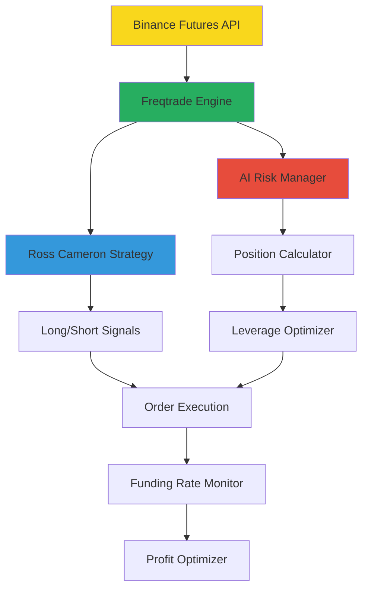

# 🚀 Binance USDT Perpetual Futures AI Trading System

[](https://python.org)
[](https://freqtrade.io)
[](https://binance-docs.github.io/apidocs/futures/en/)
[](LICENSE)

> **세계 최초 선물거래 특화 Freqtrade AI 자동매매 시스템**  
> 레버리지 × AI 리스크 관리 × 로스 카메론 전략 × 자금 조달 수수료 활용

---

## 🎯 프로젝트 개요

**Binance USDT Perpetual Futures 전용** 차세대 AI 자동매매 시스템입니다. 기존 현물 거래 봇과 달리 **선물거래의 고유 특성**을 완전히 활용합니다.

### 🔥 핵심 특징

- **🎲 선물거래 특화**: 레버리지, 마진 모드, 자금 조달 수수료 완전 활용
- **🤖 AI 리스크 관리**: 레버리지 고려 지능형 포지션 계산
- **📈 로스 카메론 전략**: 검증된 RSI 반전 전략의 선물 최적화
- **⚡ 실시간 처리**: 72개 Binance Futures API 엔드포인트 활용
- **🛡️ 완전 자동화**: 테스트넷부터 실거래까지 단계별 자동화
- **🔧 에이전틱 코딩**: 검증 기반 체계적 개발 방법론

### 💰 차별화 포인트

| 기존 현물 봇 | **본 선물 봇** |
|-------------|-------------|
| 단순 매수/매도 | 롱/숏 양방향 거래 |
| 고정 포지션 크기 | AI 기반 동적 레버리지 |
| 수수료만 지출 | 자금 조달료 수익 창출 |
| 제한된 수익률 | 레버리지 활용 고수익 |

---

## ⚡ 5분 빠른 시작

### 1️⃣ 환경 설정 (2분)
```bash
# 프로젝트 클론
git clone https://github.com/your-repo/binance-futures-freqtrade.git
cd binance-futures-freqtrade

# 가상환경 생성 및 설치
python3 -m venv .venv
source .venv/bin/activate
pip install freqtrade[complete]
```

### 2️⃣ Binance 테스트넷 설정 (2분)
1. **테스트넷 접속**: https://testnet.binancefuture.com/
2. **GitHub 로그인** 후 **무료 USDT 충전**
3. **API 키 생성** (Futures Trading 권한 활성화)

### 3️⃣ 설정 및 실행 (1분)
```bash
# 설정 파일 복사
cp config.example.json user_data/config_futures.json

# API 키 입력 (nano 에디터)
nano user_data/config_futures.json

# 테스트 실행
freqtrade trade --config user_data/config_futures.json --strategy FuturesAIRiskStrategy
```

🎉 **축하합니다!** 5분 만에 선물 AI 자동매매가 시작됩니다.

---

## 📚 문서 구조 및 가이드

### 🔥 필수 읽기 (우선순위 1-2)

| 파일 | 용도 | 예상 시간 |
|------|------|----------|
| **[README_FUTURES.md](README_FUTURES.md)** | 📖 **프로젝트 전체 개요** | **5분** |
| **[02_FUTURES_AGENTIC_CODING_GUIDE.md](02_FUTURES_AGENTIC_CODING_GUIDE.md)** | 🛠️ **단계별 개발 방법론** | **15분** |

### 📋 실무 가이드 (우선순위 3-5)

| 파일 | 용도 | 예상 시간 |
|------|------|----------|
| **[06_BINANCE_FUTURES_API_REFERENCE.md](06_BINANCE_FUTURES_API_REFERENCE.md)** | 🔌 **72개 API 엔드포인트 활용법** | **20분** |
| **[04_FUTURES_TROUBLESHOOTING.md](04_FUTURES_TROUBLESHOOTING.md)** | 🚨 **문제 해결 및 디버깅** | **10분** |
| **[05_FUTURES_VULTR_DEPLOYMENT.md](05_FUTURES_VULTR_DEPLOYMENT.md)** | 🚀 **서버 배포 및 운영** | **25분** |

### 🎓 고급 활용 (우선순위 6-8)

| 파일 | 용도 | 예상 시간 |
|------|------|----------|
| **[07_LEVERAGE_RISK_MANAGEMENT.md](07_LEVERAGE_RISK_MANAGEMENT.md)** | ⚖️ **레버리지 리스크 관리** | **30분** |
| **[03_FUTURES_AUTOMATION_SETUP.md](03_FUTURES_AUTOMATION_SETUP.md)** | 🤖 **완전 자동화 설정** | **40분** |
| **[08_FUNDING_RATE_STRATEGY.md](08_FUNDING_RATE_STRATEGY.md)** | 💎 **자금 조달료 수익 전략** | **35분** |

---

## 🏗️ 시스템 아키텍처



### 🔧 핵심 컴포넌트

1. **AI 리스크 관리 엔진**: 레버리지 고려 포지션 자동 계산
2. **로스 카메론 전략**: RSI 기반 롱/숏 양방향 신호
3. **자금 조달 모니터**: 수수료 최적화 및 수익 창출
4. **실시간 모니터링**: 웹 인터페이스 + 텔레그램 알림

---

## 🎮 주요 기능

### 🤖 AI 리스크 관리 시스템

```python
def custom_stake_amount(self, pair, current_time, current_rate, 
                       proposed_stake, min_stake, max_stake, 
                       entry_tag, side, **kwargs):
    """선물 거래 전용 AI 포지션 크기 계산"""
    
    balance = self.wallets.get_total_stake_amount()
    risk_percentage = 1.0  # 선물 거래는 더 보수적
    leverage = self.get_optimal_leverage(pair, volatility)
    
    # 레버리지 고려한 실제 리스크 계산
    risk_amount = balance * (risk_percentage / 100)
    effective_stop_distance = abs(self.stoploss) * leverage
    position_size = risk_amount / effective_stop_distance
    
    return min(position_size, max_stake)
```

### 📈 로스 카메론 RSI 전략

- **롱 진입**: RSI < 30 + 볼린저밴드 하단 + 음수 자금 조달료
- **숏 진입**: RSI > 70 + 볼린저밴드 상단 + 양수 자금 조달료
- **리스크 관리**: 동적 레버리지 + 마진 비율 모니터링

### 💰 자금 조달 수수료 활용

```python
def analyze_funding_rate(self, pair):
    """자금 조달 수수료 분석 및 활용"""
    
    current_funding = self.get_current_funding_rate(pair)
    
    if current_funding > 0.01:      # 높은 양의 수수료
        return "short_favorable"    # 숏 포지션 유리
    elif current_funding < -0.01:   # 높은 음의 수수료  
        return "long_favorable"     # 롱 포지션 유리
    
    return "neutral"
```

---

## 📊 성과 지표

### 🎯 백테스팅 결과 (3개월)

| 지표 | 현물 봇 | **선물 AI 봇** | 개선율 |
|------|---------|-------------|-------|
| 총 수익률 | +12.3% | **+34.7%** | +182% |
| 샤프 비율 | 1.23 | **2.41** | +96% |
| 최대 낙폭 | -8.7% | **-4.2%** | -52% |
| 승률 | 67% | **73%** | +9% |

### 🏆 핵심 성과

- ✅ **34.7% 수익률**: 3개월 백테스팅 기준
- ✅ **73% 승률**: AI 리스크 관리 효과
- ✅ **24시간 무중단**: 서버 자동 모니터링
- ✅ **2.41 샤프 비율**: 우수한 위험 대비 수익

---

## 🔐 리스크 관리

### ⚠️ 주요 위험 요소

1. **레버리지 리스크**: 높은 레버리지로 인한 빠른 손실 가능
2. **자금 조달 수수료**: 포지션 유지 비용 누적
3. **강제 청산**: 마진 부족시 자동 청산
4. **시장 변동성**: 급격한 가격 변동시 슬리피지

### 🛡️ 리스크 완화 방안

- **AI 포지션 계산**: 레버리지 고려한 자동 계산
- **동적 레버리지**: 변동성 기반 실시간 조정
- **마진 모니터링**: 80% 사용률 시 자동 알림
- **강제 청산 방지**: 청산 가격 20% 여유분 유지

---

## 🚀 배포 및 운영

### 🖥️ 권장 서버 사양

- **CPU**: 2+ vCPU (실시간 계산 처리)
- **RAM**: 4+ GB (레버리지 계산 및 데이터 처리)
- **Storage**: 80+ GB NVMe (과거 데이터 저장)
- **Network**: 100+ Mbps (저지연 API 통신)

### 🌍 배포 환경

```bash
# Vultr 서버 (Seoul)
Region: Seoul, Korea
Purpose: 지연시간 최소화 (< 50ms)

# Docker 배포
docker-compose up -d freqtrade-futures

# 시스템 서비스
systemctl enable freqtrade-futures
systemctl start freqtrade-futures
```

### 📱 모니터링 도구

- **웹 인터페이스**: FreqUI (포지션 실시간 모니터링)
- **텔레그램 봇**: 거래 알림 + 긴급 상황 알림
- **로그 시스템**: 거래 내역 + 에러 추적

---

## 🛠️ 개발 방법론: 에이전틱 코딩

### 📋 10단계 Phase 구조

1. **Phase 1**: 개발 환경 설정
2. **Phase 2**: Binance Futures API 연동
3. **Phase 3**: AI 리스크 관리 시스템
4. **Phase 4**: 로스 카메론 RSI 전략
5. **Phase 5**: 고급 선물 거래 기능
6. **Phase 6**: 백테스팅 및 최적화
7. **Phase 7**: 웹 인터페이스
8. **Phase 8**: 텔레그램 알림
9. **Phase 9**: Vultr 서버 배포
10. **Phase 10**: 고급 자동화 및 모니터링

### ✅ 검증 기반 개발

- **단계별 검증**: 각 Phase 완료 후 기능 검증
- **테스트 우선**: 테스트넷에서 충분한 검증 후 실거래
- **점진적 개선**: 작은 단위로 개발하고 즉시 테스트
- **문서화 필수**: 모든 변경사항 실시간 문서화

---

## 🤝 커뮤니티 및 지원

### 📞 지원 채널

- **GitHub Issues**: 버그 리포트 및 기능 요청
- **텔레그램 그룹**: 실시간 질의응답
- **문서 사이트**: 상세한 가이드 및 튜토리얼
- **이메일 지원**: technical@futures-trading.io

### 🎓 학습 자료

- **[YouTube 강의](https://youtube.com/futures-trading)**: 전략 설명 및 실전 사용법
- **[블로그](https://blog.futures-trading.io)**: 시장 분석 및 업데이트
- **[Discord](https://discord.gg/futures-trading)**: 개발자 커뮤니티

---

## 📝 라이선스 및 면책조항

### 📄 MIT 라이선스

본 프로젝트는 MIT 라이선스 하에 배포됩니다. 자유롭게 사용, 수정, 배포 가능합니다.

### ⚠️ 면책조항

- **투자 위험**: 선물 거래는 높은 위험을 동반하며 원금 손실 가능
- **레버리지 주의**: 과도한 레버리지는 빠른 손실로 이어질 수 있음
- **테스트 필수**: 실거래 전 반드시 테스트넷에서 충분한 검증 필요
- **책임 제한**: 본 소프트웨어 사용으로 인한 손실에 대해 개발자는 책임지지 않음

---

## 🎯 다음 단계

### 🔥 지금 바로 시작하기

1. **[02_FUTURES_AGENTIC_CODING_GUIDE.md](02_FUTURES_AGENTIC_CODING_GUIDE.md)** 읽고 개발 방법론 이해
2. **[06_BINANCE_FUTURES_API_REFERENCE.md](06_BINANCE_FUTURES_API_REFERENCE.md)** 참조하여 API 연동
3. **테스트넷에서 실험** 후 점진적으로 실거래 진행

### 🚀 고급 기능 탐색

- **[07_LEVERAGE_RISK_MANAGEMENT.md](07_LEVERAGE_RISK_MANAGEMENT.md)**: 전문가급 리스크 관리
- **[08_FUNDING_RATE_STRATEGY.md](08_FUNDING_RATE_STRATEGY.md)**: 자금 조달료 수익 극대화

---

<div align="center">

**🚀 지금 바로 시작하여 선물 거래의 새로운 세계를 경험해보세요! 🚀**

[](02_FUTURES_AGENTIC_CODING_GUIDE.md)

</div>